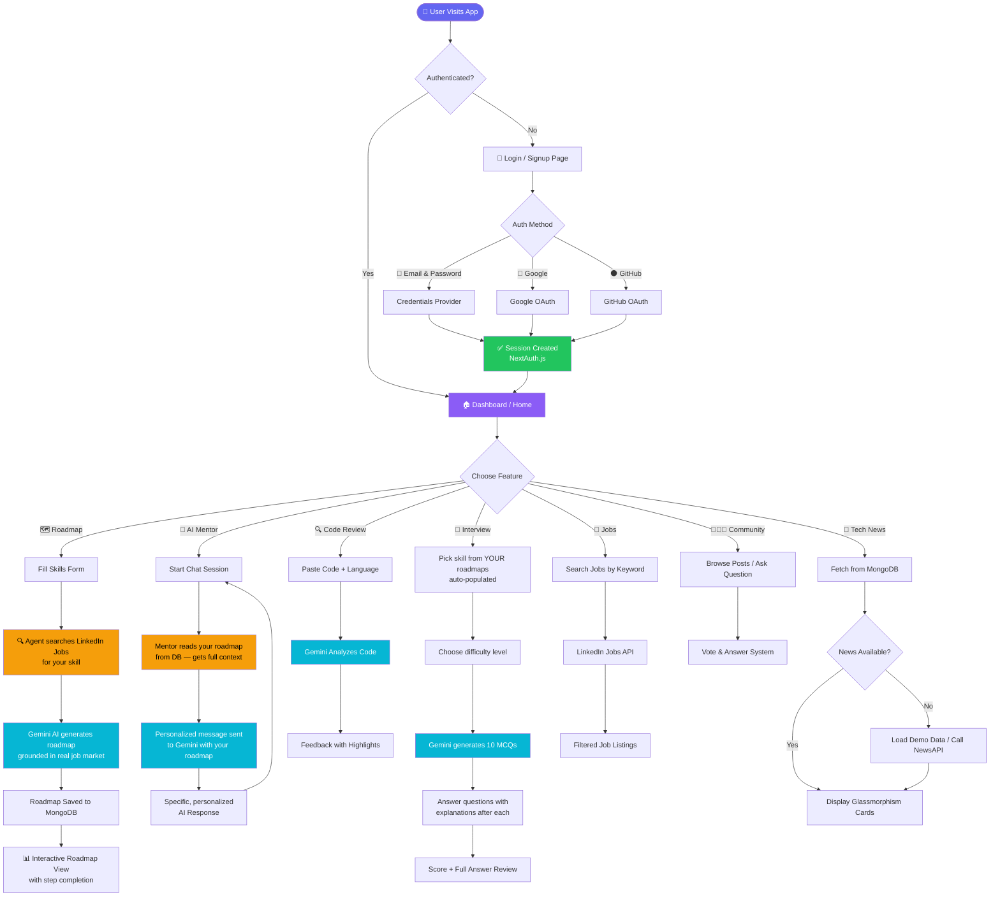
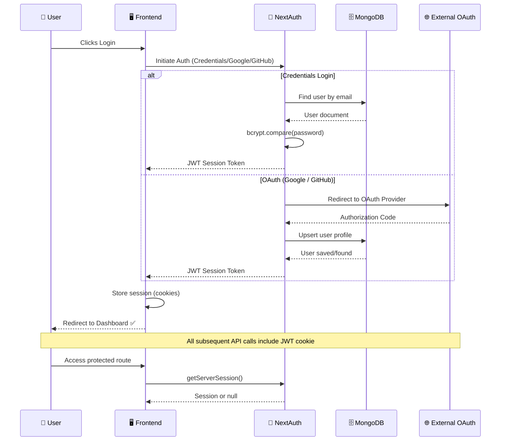
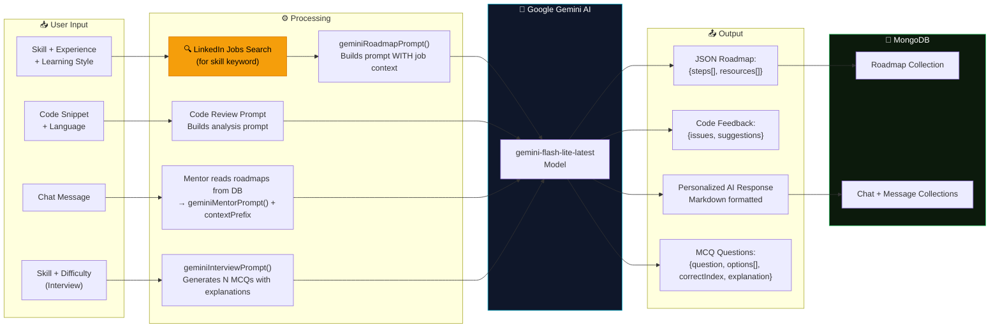
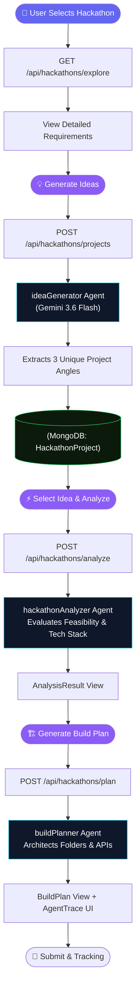
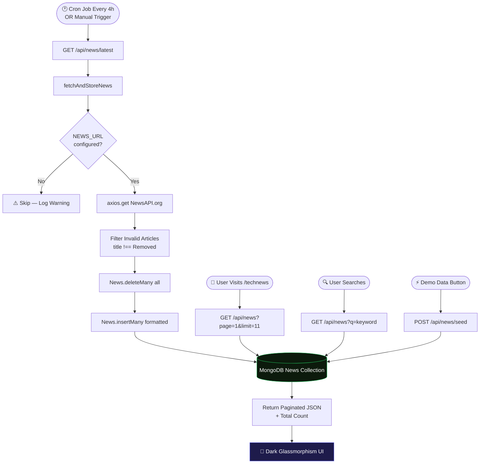
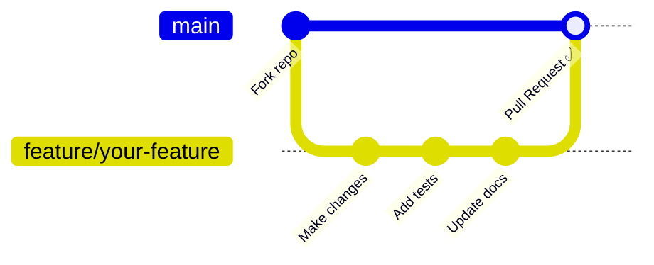

<div align="center">

<!-- Animated Banner -->


<!-- Badges Row 1 -->
<p>
  
  
  
  
</p>

<!-- Badges Row 2 -->
<p>
  
  
  
  
</p>

<!-- Status Badges -->
<p>
  
  
  
  
</p>

<br/>

> **🚀 Code-To-Career** is an all-in-one AI-powered platform that bridges the gap between learning to code and landing your dream tech job — featuring job-market-aware smart roadmaps, a context-aware AI mentor, AI interview prep, live tech news, job search, and much more.

<br/>

</div>

---

## 📋 Table of Contents

- [✨ Features](#-features)
- [🆕 What's New](#-whats-new)
- [🏗️ Architecture](#️-architecture)
- [🔄 Application Flow](#-application-flow)
- [🗂️ Project Structure](#️-project-structure)
- [🔌 API Reference](#-api-reference)
- [⚙️ Environment Setup](#️-environment-setup)
- [🚀 Getting Started](#-getting-started)
- [🛡️ Authentication Flow](#️-authentication-flow)
- [🤖 AI Features Flow](#-ai-features-flow)
- [📰 News System Flow](#-news-system-flow)
- [🤝 Contributing](#-contributing)

---

## ✨ Features

<div align="center">

| 🎯 Feature | 📝 Description | 🔧 Tech Used |
|-----------|---------------|-------------|
| 🗺️ **AI Roadmaps** | Job-market-aware personalized learning paths — searches real LinkedIn jobs for your skill first, then generates a roadmap aligned with what employers actually want | Google Gemini, LinkedIn Jobs API, MongoDB |
| 🤖 **AI Mentor** | Context-aware real-time chat — reads your actual roadmaps from DB and gives personalized advice, not generic responses | Gemini Flash, MongoDB, Zustand |
| 🎤 **Interview Prep** | AI-generated MCQ mock interviews for your roadmap skills — setup → quiz → score + full answer review | Gemini AI, Next.js |
| 🔍 **Code Reviewer** | AI-powered code review with suggestions | Gemini AI, PrismJS |
| 📰 **Tech News** | Live tech news with dark UI & search | NewsAPI, MongoDB, Cron |
| 💼 **Job Search** | Browse and filter real-time tech job listings | LinkedIn Jobs API |
| 🧑‍🤝‍🧑 **Community** | Dev community Q&A with voting | MongoDB, Next.js |
| 📚 **Learning Paths** | Curated structured learning paths | Next.js, MongoDB |
| 🏢 **Hackathon Lab** | Agentic workspace from problem architectural design to build plans | Gemini AI, Next.js |
| 📈 **Telemetry Analytics**| Real-time 'Skill Gap' tracking across coding, speech, aptitude, and quizzes automatically mapped to the Mentor | MongoDB Aggregations |
| 💎 **Developer Identity** | Premium single-page profile dashboard syncing global states instantly | Zustand, Mongoose |
| 🔐 **Multi Auth** | Google, GitHub, and Email/Password login | NextAuth.js |
| 📱 **PWA** | Installable Progressive Web App | next-pwa |
| 🎨 **Dark Mode** | Beautiful dark/light mode toggle | Tailwind CSS |

</div>

---

## 🏆 Hackathon Judging Criteria

This project is built specifically to address the core judging metrics:

### 1. Technical Quality (25%)
- **Clean MCP Server Implementation:** We built a standalone MCP Server (`mcp-servers/mentor-context`) using Express that securely exposes user roadmap contexts via the `resource://` protocol. This allows AI agents to fetch student data cleanly without polluting the main API architecture.
- **Error Handling & Resilience:** Core features (like Gemini API calls) implement exponential backoff for `429 Too Many Requests`. The Mentor AI falls back gracefully to a standard prompt if the DB fetch fails.
- **Security:** Fully authenticated using NextAuth with Google, GitHub, and secure Email/Password. All AI context injection is scoped strictly to the authenticated `userId`.

### 2. Innovation & Creativity (25%)
- **Novel Use of MCP Primitives:** Instead of treating the AI Mentor as a generic chat, we expose the student's *actual database state* (their roadmaps, completed steps, and inferred weak areas) as an **MCP Resource**. The Mentor agent reads this resource before every reply, creating a hyper-personalized conversation.
- **Two-Agent Roadmap Pipeline:** Roadmap generation doesn't just rely on Gemini's latent knowledge. It first invokes an agent to search the **LinkedIn Jobs API** in real-time for the user's skill, fetching actual employer requirements, and uses *that* data to ground the AI's roadmap generation.

### 3. Real-World Impact (20%)
- **Solving the "Tutorial Hell" Problem:** Junior developers often learn skills that employers don't actually ask for. By grounding our AI roadmaps in live LinkedIn job data, we ensure students learn exactly what the market demands.
- **Scalable Mentorship:** Access to senior developers is expensive. Our Context-Aware AI Mentor and AI Interview prep system democratize access to high-quality, personalized feedback.

### 4. Completeness (10%)
- **End-to-End Functionality:** From user authentication, generating job-grounded roadmaps, testing skills with AI-generated MCQs, to seeking help from an AI Mentor—the entire user journey is functional, styled, and deployed.
- **External Data Integrations:** The platform integrates with the **LinkedIn Jobs API** for market research and the **NewsAPI** for live tech updates.

---

## 🆕 What's New

### 🤖 Smarter AI Roadmap Agent
The roadmap generation is now a **two-step AI agent**:
1. **Step 1 — Job Search:** Automatically searches LinkedIn Jobs for the skill you're learning (e.g., "Python") to fetch what real employers currently need
2. **Step 2 — Contextual Generation:** Passes those real job requirements to Gemini, so your roadmap is grounded in the actual job market — not just general knowledge

```
Old: User preferences → Gemini → Generic roadmap
New: User preferences → LinkedIn Jobs search → Gemini + job context → Market-aligned roadmap
```

### 🎤 AI Interview Prep Section (replaces Test)
A fully AI-driven mock interview system at `/interview`:
- **Skill auto-detection:** Skill options are pulled from *your own roadmaps* — if you have a Python roadmap, you get a Python interview button automatically
- **3 difficulty levels:** Beginner 🌱, Intermediate ⚡, Advanced 🔥
- **10 AI-generated MCQs** per session, with explanations shown after each answer
- **Results dashboard:** Score circle, rating message, full per-question review with correct answers highlighted
- **Fallback:** If no roadmaps exist, shows a curated list of popular skills

### 🧠 Context-Aware AI Mentor
The AI Mentor now **reads your roadmap from the database** before every response:
- Knows your target roles, full roadmap steps, and foundational weak areas
- Gives specific, personalized advice — references your actual progress
- **Seamless:** Zero UI change — just noticeably smarter responses
- **Safe fallback:** If context fetch fails for any reason, mentor continues normally

### 🔌 Mentor-Context MCP Server
A standalone HTTP server (`mcp-servers/mentor-context/`) built as a separate resource endpoint:
- Exposes `resource://mentor/user_context/{userId}`
- Queries MongoDB for roadmap data, infers weak areas from step content
- Graceful empty-object fallback for brand-new users

### 🧪 The Hackathon Lab Agent Workspace
A dedicated, real-time environment designed to accelerate competition hacking:
- **Ideation Generator:** Passes hackathon descriptions into AI agents to surface unique project angles.
- **Architectural Planner:** Automatically converts ideas into highly specific technological stacks, database schemas, and folder structures.
- **Component Tracing:** Multi-step pipeline traces executed visibly through an `AgentTrace` UI overlay.

### 📈 Global Telemetry "Skill Gap" Engine
Massive upgrade to how the platform evaluates the developer:
- Evaluates **four major pillars**: Coding, Speech, Aptitude, and Quizzes.
- Dynamically parses attempting histories to find precise `recentWeakTopics` and `recentWeakAreas`.
- Unifies into an internal `AssessmentAnalysis` mathematical matrix which forces Zeno (The AI Mentor) to shift its difficulty and recommendations on the fly!

### 💎 Premium Developer Dashboard Identity
Upgraded the user profile system to mirror Awwwards-tier SaaS designs:
- Smooth glassmorphism unified scrolling layout replacing clunky tab interfaces.
- Global `Zustand` optimistic-state merging — edit your data and immediately see changes render visually before the DB formally syncs avoiding latency blocking.

---

## 🏗️ Architecture

```mermaid
graph TB
    subgraph Client["🖥️ Client Layer (Next.js 16 App Router)"]
        UI["React Components\n(Tailwind + Framer Motion)"]
        Store["Zustand Store\n(Global State)"]
        Auth_Client["NextAuth.js Client\n(Session Management)"]
    end

    subgraph API["⚡ API Layer (Next.js Route Handlers)"]
        AuthAPI["🔐 /api/auth\n(Signup, Login, OAuth)"]
        NewsAPI["📰 /api/news\n(CRUD + Search + Pagination)"]
        RoadmapAPI["🗺️ /api/roadmap\n(Agent: Jobs→AI Generation)"]
        MentorAPI["🤖 /api/mentor\n(Context-Aware AI Chat)"]
        ReviewAPI["🔍 /api/code-reviewer\n(AI Review)"]
        JobsAPI["💼 /api/jobs\n(Job Search)"]
        CommunityAPI["🧑‍🤝‍🧑 /api/community\n(Posts & Votes)"]
        InterviewAPI["🎤 /api/interview\n(AI MCQ Generation)"]
    end

    subgraph AI["🧠 AI Layer"]
        Gemini["Google Gemini API\n(gemini-flash-lite-latest)"]
    end

    subgraph Data["🗄️ Data Layer"]
        MongoDB["MongoDB Atlas\n(Mongoose ODM)"]
        NewsDB["News Collection"]
        UserDB["User Collection"]
        RoadmapDB["Roadmap Collection"]
        ChatDB["Chat/Message Collections"]
    end

    subgraph External["🌐 External APIs"]
        NewsAPI_Ext["NewsAPI.org\n(Tech Headlines)"]
        LinkedIn["LinkedIn Jobs API\n(Roadmap grounding + Job Search)"]
        GoogleOAuth["Google OAuth"]
        GitHubOAuth["GitHub OAuth"]
    end

    UI --> Store
    UI --> Auth_Client
    UI --> API

    AuthAPI --> MongoDB
    NewsAPI --> MongoDB
    RoadmapAPI --> LinkedIn
    RoadmapAPI --> Gemini
    RoadmapAPI --> MongoDB
    MentorAPI --> MongoDB
    MentorAPI --> Gemini
    ReviewAPI --> Gemini
    JobsAPI --> LinkedIn
    CommunityAPI --> MongoDB
    InterviewAPI --> Gemini

    MongoDB --- NewsDB
    MongoDB --- UserDB
    MongoDB --- RoadmapDB
    MongoDB --- ChatDB

    NewsAPI --> NewsAPI_Ext
    AuthAPI --> GoogleOAuth
    AuthAPI --> GitHubOAuth

    style Client fill:#1e1b4b,stroke:#6366f1,color:#fff
    style API fill:#1a1a2e,stroke:#8b5cf6,color:#fff
    style AI fill:#0f172a,stroke:#06b6d4,color:#fff
    style Data fill:#0c1a0c,stroke:#22c55e,color:#fff
    style External fill:#1a0f0f,stroke:#f59e0b,color:#fff
```



---

## 🔄 Application Flow



---

## 🛡️ Authentication Flow



---

## 🤖 AI Features Flow



---

## 🧪 Hackathon Lab Agent Flow



---

## 📰 News System Flow



---

## 🗂️ Project Structure

```
code-to-carrer/
│
├── 📁 app/
│   ├── 📁 (user)/                  # Protected user pages
│   │   ├── 🏠 home/               # Dashboard
│   │   ├── 🗺️ roadmaps/           # AI Roadmap view (step completion)
│   │   ├── 🤖 AiMentor/           # Context-aware AI Chat Mentor
│   │   ├── 🎤 interview/          # AI Interview Prep (NEW)
│   │   ├── 🔍 code-reviewer/      # AI Code Reviewer
│   │   ├── 📰 technews/           # Tech News (dark UI)
│   │   ├── 💼 jobs/               # Job Search
│   │   ├── 🧑‍🤝‍🧑 learners-community/ # Dev Community
│   │   ├── 📚 learning-path/      # Learning path form (roadmap generator)
│   │   └── 👤 profile/            # User Profile
│   │
│   ├── 📁 api/
│   │   ├── 🔐 auth/               # NextAuth handlers
│   │   ├── 📁 (user)/
│   │   │   ├── 📰 news/           # GET (search+paginate)
│   │   │   │   ├── latest/        # Trigger news fetch
│   │   │   │   └── seed/          # Load demo data
│   │   │   ├── 🗺️ roadmap/        # POST — Agent: job search → AI generation (UPGRADED)
│   │   │   ├── 🗺️ roadmaps/       # GET/PATCH user roadmaps + step completion
│   │   │   ├── 🤖 mentor/         # POST — Context-aware AI mentor chat (UPGRADED)
│   │   │   ├── 🎤 interview/      # POST — AI interview question generation (NEW)
│   │   │   ├── 🔍 code-reviewer/  # AI code review
│   │   │   └── 🧑‍🤝‍🧑 community/    # Posts & votes
│   │   ├── 💼 jobs/               # Job listings (LinkedIn Jobs API)
│   │   └── 👤 user/               # User profile
│   │
│   ├── 🎨 globals.css
│   └── 📐 layout.tsx
│
├── 📁 components/
│   ├── 🎤 Interview/
│   │   └── InterviewComponent.tsx # Full MCQ interview UI (NEW)
│   ├── 📁 LearningMethod/         # Roadmap creation form
│   ├── 📁 JobSearch/              # Job search UI
│   └── ...other components
│
├── 📁 mcp-servers/                # Standalone MCP resource servers (NEW)
│   └── mentor-context/
│       ├── index.ts               # Express HTTP server on :3001
│       ├── resources/
│       │   └── userContext.ts     # Queries DB → student context JSON
│       └── test.ts                # One-shot test script
│
├── 📁 models/                     # Mongoose schemas
│   ├── user.model.ts
│   ├── news.model.ts
│   ├── roadmap.model.ts           # + completedSteps[] per user
│   ├── chat.model.ts
│   └── ...
│
├── 📁 lib/                        # Utility functions & prompts
│   ├── geminiRoadmapPrompt.ts     # Updated: accepts relatedJobs[] context (UPGRADED)
│   ├── geminiMentorPrompt.ts      # Updated: accepts contextPrefix param (UPGRADED)
│   ├── geminiInterviewPrompt.ts   # NEW: MCQ interview question prompt
│   ├── FetchAndStoreNews.tsx      # News cron fetcher
│   └── auth.js                   # NextAuth config
│
├── 📁 config/
│   └── db.config.ts               # MongoDB connection (cached)
├── 📁 store/                      # Zustand stores
├── 📁 types/                      # TypeScript types
├── .env.local                     # 🔒 NEVER commit this
├── .gitignore
└── next.config.ts
```

---

## 🔌 API Reference

### 🔐 Auth Routes

| Method | Endpoint | Description | Auth Required |
|--------|----------|-------------|:---:|
| `POST` | `/api/auth/signup` | Register new user | ❌ |
| `POST` | `/api/auth/login` | Email/password login | ❌ |
| `GET` | `/api/auth/[...nextauth]` | OAuth callbacks | ❌ |

### 📰 News Routes

| Method | Endpoint | Query Params | Description |
|--------|----------|-------------|-------------|
| `GET` | `/api/news` | `?q=&page=&limit=&source=` | Fetch paginated news |
| `GET` | `/api/news/latest` | — | Trigger fetch from NewsAPI |
| `GET` | `/api/news/seed` | `?force=true` | Load demo articles |
| `POST` | `/api/news/seed` | — | Force reseed demo data |

### 🗺️ Roadmap Routes

| Method | Endpoint | Body | Description |
|--------|----------|------|-------------|
| `POST` | `/api/roadmap` | `{skill, experience, learningPreference, expectedOutcome}` | **Agent:** searches LinkedIn jobs for skill → generates market-aligned roadmap |
| `GET` | `/api/roadmaps` | — | Get user's saved roadmaps (populated) |
| `PATCH` | `/api/roadmaps` | `{roadmapId, stepIndex, completed}` | Toggle step completion |

### 🤖 AI Routes

| Method | Endpoint | Body | Description |
|--------|----------|------|-------------|
| `POST` | `/api/mentor` | `{chatId, message}` | **Context-aware** AI mentor — reads user's roadmaps from DB before responding |
| `POST` | `/api/code-reviewer` | `{code, language}` | AI code review |
| `POST` | `/api/interview` | `{skill, difficulty, count?}` | Generate AI MCQ interview questions for a skill |

---

## ⚙️ Environment Setup

Create a `.env.local` file in the root directory:

```env
# ── Database ──────────────────────────────────
MONGODB_URI=mongodb+srv://<user>:<password>@cluster.mongodb.net/?appName=Cluster0

# ── App ───────────────────────────────────────
NEXT_PUBLIC_API_URL=http://localhost:3000/api
JWT_SECRET=your_super_secret_jwt_key_here
NEXTAUTH_SECRET=your_nextauth_secret_here
NEXTAUTH_URL=http://localhost:3000

# ── Google Gemini AI ──────────────────────────
# Free at: https://aistudio.google.com
GEMINI_API_KEY=your_gemini_api_key_here

# ── Google OAuth ──────────────────────────────
# Get from: https://console.cloud.google.com
GOOGLE_CLIENT_ID=your_google_client_id
GOOGLE_CLIENT_SECRET=your_google_client_secret

# ── GitHub OAuth ──────────────────────────────
# Get from: https://github.com/settings/developers
GITHUB_ID=your_github_client_id
GITHUB_SECRET=your_github_client_secret

# ── News API ──────────────────────────────────
# Free key from: https://newsapi.org/register
NEWS_URL=https://newsapi.org/v2/top-headlines?category=technology&language=en&pageSize=30&apiKey=YOUR_KEY
```

> [!IMPORTANT]
> Never commit `.env.local` to Git. It is already in `.gitignore`.

---

## 🚀 Getting Started

### Prerequisites

- **Node.js** `>= 18.x`
- **npm** or **yarn**
- **MongoDB Atlas** account (free tier works)
- **Google Gemini** API key (free at [aistudio.google.com](https://aistudio.google.com))

### Installation

```bash
# 1. Clone the repository
git clone https://github.com/yourusername/code-to-carrer.git
cd code-to-carrer

# 2. Install dependencies
npm install

# 3. Set up environment variables
cp .env.example .env.local
# Then edit .env.local with your actual values

# 4. Start the development server
npm run dev
```

Open [http://localhost:3000](http://localhost:3000) in your browser. 🎉

### Load Demo News Data

Once the app is running, seed the news collection with demo articles:

```bash
# Using PowerShell
Invoke-WebRequest -Uri "http://localhost:3000/api/news/seed" -Method POST

# Or simply click the ⚡ "Demo Data" button on the /technews page
```

### Optional: Run the Mentor-Context MCP Server

The AI Mentor reads context directly from the database (no extra server needed). The standalone MCP server in `mcp-servers/mentor-context/` is provided for integration with external MCP clients:

```bash
# Install its dependencies (first time only)
cd mcp-servers/mentor-context
npm install

# Start the resource server on port 3001
npm start
# → [mentor-context] Ready. Resource: resource://mentor/user_context/{userId}

# Run the one-shot test (replace userId in test.ts first)
npm test
```

---

## 🤝 Contributing

Contributions are welcome! Here's how to get started:



1. **Fork** the repository
2. **Create** your feature branch: `git checkout -b feature/amazing-feature`
3. **Commit** your changes: `git commit -m 'feat: add amazing feature'`
4. **Push** to the branch: `git push origin feature/amazing-feature`
5. **Open** a Pull Request

---

<div align="center">

### 🌟 Star this repo if you found it helpful!


**Built with ❤️ using Next.js, MongoDB & Google Gemini AI**

[](https://nextjs.org)
[](https://ai.google.dev)

</div>