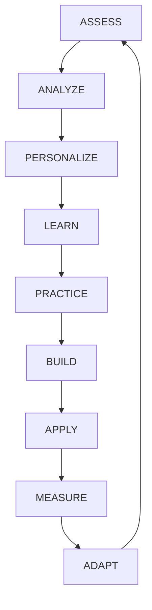
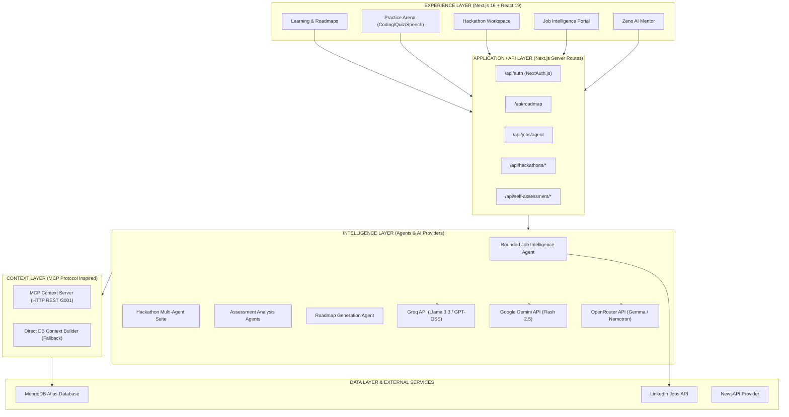
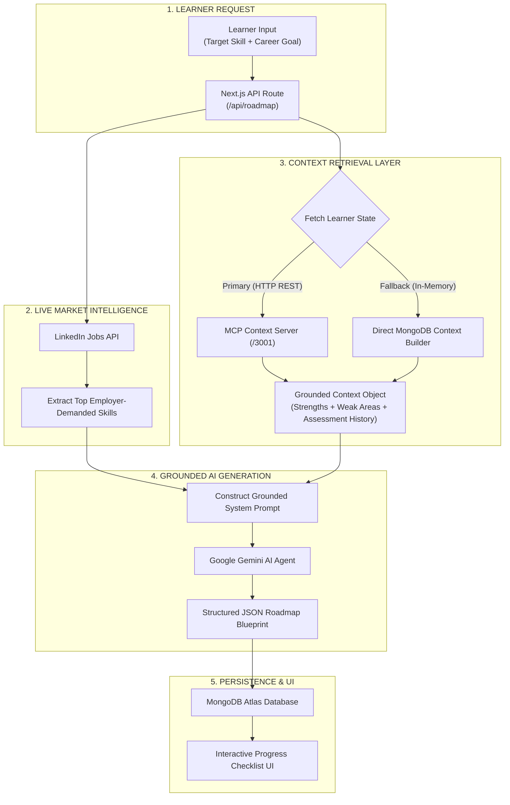
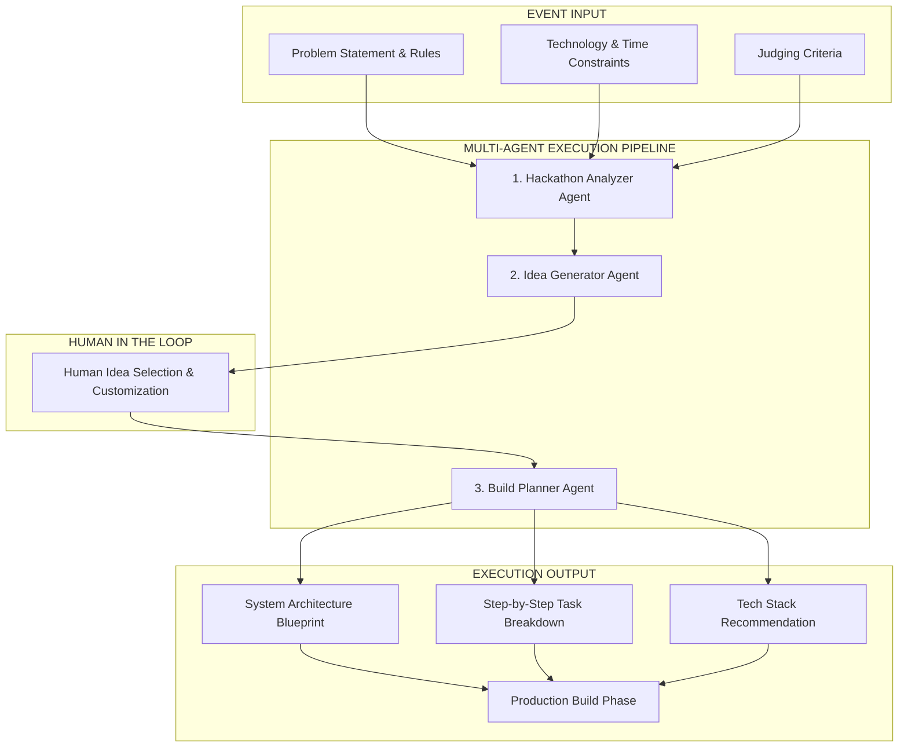
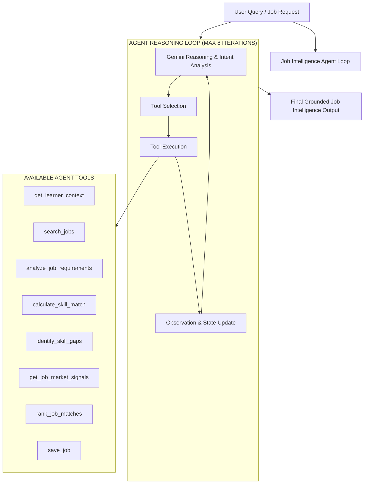
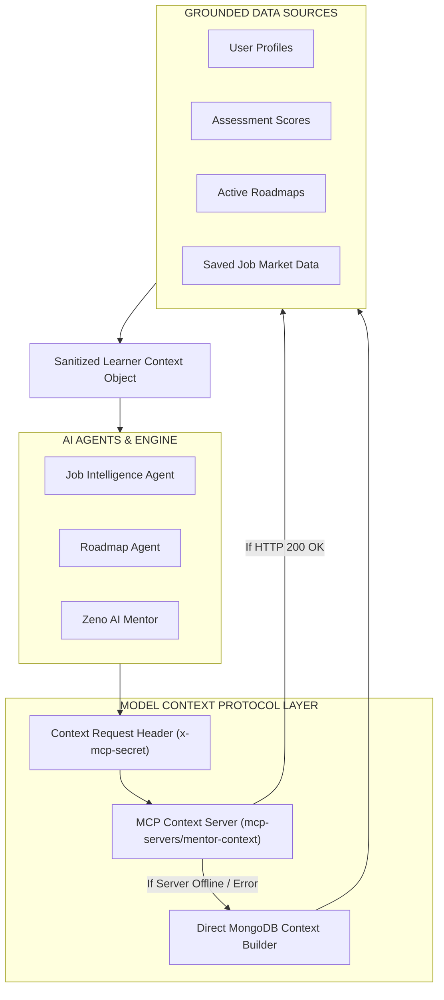
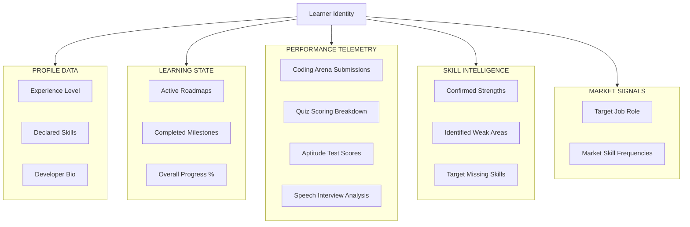

<div align="center">

# Nexus Learning Engine

### AI-Native Adaptive Learning, Project Building & Career Intelligence Platform

<p align="center">
  A unified, data-grounded intelligence engine bridging the gap between learner assessment, personalized skill acquisition, rapid project execution, and real-time tech job market demand.
</p>

<!-- Technology Badges -->
<p>
  
  
  
  
  
  
  
  
  
  
</p>

<!-- Verification & Build Badges -->
<p>
  
  
  
  
  
</p>

</div>

---

## 📋 Table of Contents

- [💡 What is Nexus?](#-what-is-nexus)
- [🎯 Why Nexus?](#-why-nexus)
- [🔄 Core Intelligence Loop](#-core-intelligence-loop)
- [🏗️ 1 → Overall Architecture](#1--overall-architecture)
- [🗺️ 2 → Adaptive Roadmap](#2--adaptive-roadmap)
- [🧪 3 → Hackathon Multi-Agent System](#3--hackathon-multi-agent-system)
- [💼 4 → Job Intelligence Agent](#4--job-intelligence-agent)
- [🔌 5 → MCP + Context Architecture](#5--mcp--context-architecture)
- [🧠 Learner Context Model](#-learner-context-model)
- [🤖 AI Agent Architecture](#-ai-agent-architecture)
- [🔄 Continuous Learning Intelligence Loop](#-continuous-learning-intelligence-loop)
- [🔐 Security & Reliability](#-security--reliability)
- [⚙️ Engineering Principles](#-engineering-principles)
- [🛠️ Technology Stack](#️-technology-stack)
- [📊 Verified Implementation](#-verified-implementation)
- [🗂️ Project Structure](#️-project-structure)
- [🎬 End-to-End Demo](#-end-to-end-demo)
- [🚀 Getting Started](#-getting-started)
- [🔑 Environment Variables](#-environment-variables)
- [🔮 Future Roadmap](#-future-roadmap)
- [📜 License](#-license)

---

## 💡 What is Nexus?

**Nexus Learning Engine** (Code-To-Career) is an engineering-grade, context-grounded adaptive learning and career intelligence platform. Rather than serving static video playlists or generic AI prompts, Nexus operates as a **closed-loop state engine** that continuously synthesizes learner performance across multimodal assessments, constructs a living skill profile, generates market-aligned roadmaps, facilitates rapid project prototyping, and delivers bounded-autonomous job market matching.

```
Learner State ──► Assessment ──► Skill Intelligence ──► Personalized Learning ──► Practice ──► Projects ──► Job Market ──► Adaptation
```

The system tightly unifies **deterministic code** (math matching, skill normalization, database aggregations, and constraint checks) with **probabilistic AI reasoning** (multimodal evaluation, semantic goal breakdown, agent tool execution), ensuring high-fidelity personalization without hallucinated curriculum paths.

---

## 🎯 Why Nexus?

Traditional EdTech platforms treat learning, assessment, project building, and job searching as isolated, disconnected silos. Generic LLM wrappers fail because they generate hallucinated roadmaps ungrounded by what a developer actually knows or what employers actually require.

Nexus eliminates this disconnect by grounding every AI interaction in a unified **Learner Context Layer**.


```mermaid
graph TD
    A["ASSESS"] --> B["ANALYZE"]
    B --> C["PERSONALIZE"]
    C --> D["LEARN"]
    D --> E["PRACTICE"]
    E --> F["BUILD"]
    F --> G["APPLY"]
    G --> H["MEASURE"]
    H --> I["ADAPT"]
    I --> A
```

### Key Architectural Differences

| Capability | Generic LLM Wrappers | Nexus Learning Engine |
| :--- | :--- | :--- |
| **Context Source** | Single static user prompt | Multi-source aggregate (MongoDB + Assessments + Skill Gaps + Market Signals) |
| **Roadmap Generation** | Generic prompt completion | Grounded prompt synthesized from assessment evidence & live LinkedIn market signals |
| **Computation Model** | AI guesses skill match & scores | Code computes exact match percentages; AI handles semantic reasoning |
| **Job Search** | Keyword lookup or links | Bounded-Autonomous Agent with 8 execution tools & skill alias normalization |
| **Context Pipeline** | Injected raw prompt text | Model Context Protocol (MCP) server layer with direct DB fallback |
| **Safety & Control** | Unbounded mutation | Human-in-the-loop confirmation for write operations (`save_job`, roadmap saves) |

---

## 🔄 Core Intelligence Loop

```
[ Multimodal Assessments (Coding, Quiz, Aptitude, Speech) ]
                           │
                           ▼
              [ MongoDB Aggregation Engine ]
                           │
                           ▼
          [ Skill Gap Profile (Strong / Weak / Missing) ]
                           │
                           ▼
         [ MCP / Direct Context Compilation Layer ]
                           │
                           ▼
       [ Job Market Signals (LinkedIn Live API) ]
                           │
                           ▼
      [ Contextual AI Reasoning (Roadmap & Agents) ]
                           │
                           ▼
          [ Adaptive Personalization & Practice ]
```

---

## 1 → Overall Architecture

Nexus is structured into distinct, isolated architectural tiers to guarantee modularity, fault tolerance, and observable agent tool calls.


```mermaid
graph TD
    subgraph EXPERIENCE["EXPERIENCE LAYER (Next.js 16 + React 19)"]
        UI_LEARN["Learning & Roadmaps"]
        UI_PRACTICE["Practice Arena (Coding/Quiz/Speech)"]
        UI_HACKATHON["Hackathon Workspace"]
        UI_JOBS["Job Intelligence Portal"]
        UI_MENTOR["Zeno AI Mentor"]
    end

    subgraph APPLICATION["APPLICATION / API LAYER (Next.js Server Routes)"]
        API_AUTH["/api/auth (NextAuth.js)"]
        API_ROADMAP["/api/roadmap"]
        API_AGENT["/api/jobs/agent"]
        API_HACKATHON["/api/hackathons/*"]
        API_ASSESS["/api/self-assessment/*"]
    end

    subgraph INTELLIGENCE["INTELLIGENCE LAYER (Agents & AI Providers)"]
        AGENT_JOB["Bounded Job Intelligence Agent"]
        AGENT_HACK["Hackathon Multi-Agent Suite"]
        AGENT_EVAL["Assessment Analysis Agents"]
        AGENT_ROADMAP["Roadmap Generation Agent"]
        GROQ_CLIENT["Groq API (Llama 3.3 / GPT-OSS)"]
        GEMINI_CLIENT["Google Gemini API (Flash 2.5)"]
        OPENROUTER_CLIENT["OpenRouter API (Gemma / Nemotron)"]
    end

    subgraph CONTEXT["CONTEXT LAYER (MCP Protocol Inspired)"]
        MCP_SERVER["MCP Context Server (HTTP REST /3001)"]
        DIRECT_BUILDER["Direct DB Context Builder (Fallback)"]
    end

    subgraph DATA["DATA LAYER & EXTERNAL SERVICES"]
        MONGO["MongoDB Atlas Database"]
        LINKEDIN_API["LinkedIn Jobs API"]
        NEWS_API["NewsAPI Provider"]
    end

    UI_LEARN & UI_PRACTICE & UI_HACKATHON & UI_JOBS & UI_MENTOR --> APPLICATION
    APPLICATION --> INTELLIGENCE
    INTELLIGENCE --> CONTEXT
    INTELLIGENCE --> GROQ_CLIENT & GEMINI_CLIENT & OPENROUTER_CLIENT
    CONTEXT --> MONGO
    AGENT_JOB --> LINKEDIN_API
```

### Architecture Principles

1. **AI Reasons, Tools Retrieve**: LLMs evaluate complex semantics and synthesize responses; tools pull structured state from databases and external APIs.
2. **Deterministic Code Computes**: Math scoring, skill normalization, set intersections, and percentage rankings are strictly executed by TypeScript functions—never left to LLM probability.
3. **MongoDB Persists**: All state mutations (user profiles, quiz attempts, coding progress, active roadmaps, saved jobs) are explicitly validated and committed to MongoDB.
4. **Context Layer Supplies Grounding**: Agents access state via the Model Context Protocol (MCP) server tier or native direct context compilation.
5. **Humans Control Consequential Actions**: State-changing operations (such as saving jobs to profile or triggering roadmap regeneration) require explicit user confirmation.

---

## 2 → Adaptive Roadmap

The Adaptive Roadmap pipeline generates personalized, employer-aligned learning paths by fusing the learner's skill state with real-time job market requirements.


```mermaid
graph TD
    subgraph STEP1["1. LEARNER REQUEST"]
        USER["Learner Input<br/>(Target Skill + Career Goal)"] --> API["Next.js API Route<br/>(/api/roadmap)"]
    end

    subgraph STEP2["2. LIVE MARKET INTELLIGENCE"]
        API --> MARKET["LinkedIn Jobs API"]
        MARKET --> MARKET_DATA["Extract Top Employer-Demanded Skills"]
    end

    subgraph STEP3["3. CONTEXT RETRIEVAL LAYER"]
        API --> CONTEXT_CHECK{"Fetch Learner State"}
        CONTEXT_CHECK -- "Primary (HTTP REST)" --> MCP["MCP Context Server (/3001)"]
        CONTEXT_CHECK -- "Fallback (In-Memory)" --> DIRECT_DB["Direct MongoDB Context Builder"]
        MCP & DIRECT_DB --> CONTEXT_OBJ["Grounded Context Object<br/>(Strengths + Weak Areas + Assessment History)"]
    end

    subgraph STEP4["4. GROUNDED AI GENERATION"]
        MARKET_DATA & CONTEXT_OBJ --> PROMPT["Construct Grounded System Prompt"]
        PROMPT --> GEMINI["Google Gemini AI Agent"]
        GEMINI --> ROADMAP_JSON["Structured JSON Roadmap Blueprint"]
    end

    subgraph STEP5["5. PERSISTENCE & UI"]
        ROADMAP_JSON --> DB["MongoDB Atlas Database"]
        DB --> UI["Interactive Progress Checklist UI"]
    end
```

### Step-by-Step Adaptive Pipeline Breakdown

1. **Learner Input**: The user selects a target role (e.g., *Full Stack Engineer*) and current skill level.
2. **Market Signal Retrieval**: `/api/roadmap` queries the live LinkedIn Jobs API to extract real-time employer skill frequencies for that role.
3. **Grounded Context Synthesis**: The Model Context Protocol (MCP) layer or Direct DB Builder compiles the user's assessment history, declared strengths, and identified weak areas.
4. **Context-Grounded Generation**: Google Gemini AI receives the synthesized prompt, suppressing topics the learner has already mastered and prioritizing their assessment weak spots and top employer demands.
5. **Database Persistence & UI Sync**: The generated JSON blueprint is saved to MongoDB and rendered into an interactive step-by-step milestone checklist.

### Learner Context Passed to the Model

```json
{
  "learnerId": "650f123456789abcdef01234",
  "careerGoal": "Full Stack Engineer",
  "experienceLevel": "Intermediate",
  "skillGap": {
    "strengths": ["JavaScript", "React.js", "HTML5"],
    "weakAreas": ["MongoDB Query Optimization", "SQL Joins"],
    "missingSkills": ["Docker", "Kubernetes", "Redis"]
  },
  "marketSignals": {
    "targetRole": "Full Stack Engineer",
    "topDemandedSkills": ["TypeScript", "Docker", "Node.js", "GraphQL"],
    "sampleCount": 15
  }
}
```

### Grounded Generation vs. Generic LLMs

```
Generic LLM Approach:
User Input ("Learn React") ──► Generic Prompt ──► LLM ──► Generic static roadmap (Includes skills user already knows)

Nexus Grounded Approach:
User Input ("Learn React")
  + Assessment Evidence
  + Skill Gap Analysis (Strengths vs Weaknesses)
  + Live Job Market Frequencies
  ──► MCP Context Layer ──► Gemini AI ──► Adaptive Roadmap (Suppresses known strengths, prioritizes weak/missing skills)
```

---

## 3 → Hackathon Multi-Agent System

The Hackathon Multi-Agent workspace assists solo developers and teams through rapid prototyping events by enforcing a structured sequence: ideation, architecture design, and milestone breakdown.


```mermaid
graph TD
    subgraph INPUT["EVENT INPUT"]
        PROBLEM["Problem Statement & Rules"]
        CONSTRAINTS["Technology & Time Constraints"]
        CRITERIA["Judging Criteria"]
    end

    subgraph AGENTS["MULTI-AGENT EXECUTION PIPELINE"]
        ANALYZER["1. Hackathon Analyzer Agent"]
        IDEATOR["2. Idea Generator Agent"]
        PLANNER["3. Build Planner Agent"]
    end

    subgraph HUMAN["HUMAN IN THE LOOP"]
        SELECTION["Human Idea Selection & Customization"]
    end

    subgraph OUTPUT["EXECUTION OUTPUT"]
        ARCH["System Architecture Blueprint"]
        TASKS["Step-by-Step Task Breakdown"]
        STACK["Tech Stack Recommendation"]
        BUILD["Production Build Phase"]
    end

    PROBLEM & CONSTRAINTS & CRITERIA --> ANALYZER
    ANALYZER --> IDEATOR
    IDEATOR --> SELECTION
    SELECTION --> PLANNER
    PLANNER --> ARCH & TASKS & STACK
    ARCH & TASKS & STACK --> BUILD
```

### Agent Roles in the Hackathon Suite

1. **Hackathon Analyzer Agent** (`lib/agents/hackathon/hackathonAnalyzer.ts`): Parses event briefs, extracts core constraints, identifies key judging criteria, and highlights technical risks.
2. **Idea Generator Agent** (`lib/agents/hackathon/ideaGenerator.ts`): Produces candidate project concepts aligned with hackathon themes and constraints.
3. **Human Idea Selection**: The developer evaluates generated concepts and selects/customizes the winning idea.
4. **Build Planner Agent** (`lib/agents/hackathon/buildPlanner.ts`): Transforms the chosen concept into a structured implementation plan complete with architectural layers, database schema drafts, API route requirements, and milestone checklists.

> [!NOTE]
> Hackathon Project Generation is cleanly decoupled from Hackathon Discovery/Search, ensuring dedicated processing for project synthesis.

---

## 4 → Job Intelligence Agent

The **Job Intelligence Agent** is a bounded-autonomous agent that autonomously formulates query strategies, retrieves learner context, searches live job listings, analyzes job descriptions, calculates deterministic skill matches, identifies critical skill gaps, and ranks opportunities.


```mermaid
graph TD
    START["User Query / Job Request"] --> AGENT["Job Intelligence Agent Loop"]
    
    subgraph LOOP["AGENT REASONING LOOP (MAX 8 ITERATIONS)"]
        REASON["Gemini Reasoning & Intent Analysis"]
        TOOL_SEL["Tool Selection"]
        EXEC["Tool Execution"]
        OBSERVE["Observation & State Update"]
        
        REASON --> TOOL_SEL
        TOOL_SEL --> EXEC
        EXEC --> OBSERVE
        OBSERVE --> REASON
    end

    START --> LOOP

    subgraph TOOLS["AVAILABLE AGENT TOOLS"]
        T1["get_learner_context"]
        T2["search_jobs"]
        T3["analyze_job_requirements"]
        T4["calculate_skill_match"]
        T5["identify_skill_gaps"]
        T6["get_job_market_signals"]
        T7["rank_job_matches"]
        T8["save_job"]
    end

    EXEC --> TOOLS
    LOOP --> STOP["Final Grounded Job Intelligence Output"]
```

### Agent Tool Reference Table

| Tool Name | Purpose | Execution Mechanism |
| :--- | :--- | :--- |
| `get_learner_context` | Retrieve grounded learner profile, active roadmaps, and assessment skill gaps | MCP Server / MongoDB Direct Builder |
| `search_jobs` | Query live job postings from LinkedIn API with experience & location filters | External LinkedIn API |
| `analyze_job_requirements` | Extract required skills, tools, and responsibilities from unstructured text | AI Reasoning |
| `calculate_skill_match` | Compute exact skill overlap percentage using alias normalization | Deterministic Code |
| `identify_skill_gaps` | Categorize skills into `STRONG`, `PARTIAL`, and `CRITICAL` gap severities | Deterministic Code |
| `get_job_market_signals` | Compute keyword occurrence frequencies across analyzed job listings | Deterministic Code |
| `rank_job_matches` | Sort opportunities using normalized composite match scoring | Deterministic Code |
| `save_job` | Persist selected job opportunity to user profile (Requires `confirm: true`) | Controlled MongoDB Write |

### Deterministic Computation vs. AI Reasoning

To eliminate financial calculation errors and inaccurate rankings, Nexus cleanly divides responsibility:

- **AI Reasoning**: Semantic goal interpretation, unstructured job requirement extraction, unstructured role summary.
- **Deterministic Code**: Skill alias normalization (`React.js` = `React`, `NodeJS` = `Node.js`), percentage calculations, set operations, frequency counts, score sorting.

### Untrusted Data Handling & Bounded Autonomy

- **Prompt Injection Defense**: External job descriptions are wrapped in strict data delimiters and treated exclusively as untrusted data inputs.
- **Iteration Bounds**: Hard-coded upper limit of `MAX_AGENT_ITERATIONS = 8` prevents infinite execution loops.
- **Write Safety**: The `save_job` tool strictly rejects requests unless `confirm: true` is explicitly provided by the user.

---

## 5 → MCP + Context Architecture

The Model Context Protocol (MCP) server layer standardizes context retrieval across AI agents, decoupling data fetching from LLM reasoning.


```mermaid
graph TD
    subgraph CLIENTS["AI AGENTS & ENGINE"]
        AGENT_JOB["Job Intelligence Agent"]
        AGENT_ROADMAP["Roadmap Agent"]
        AGENT_MENTOR["Zeno AI Mentor"]
    end

    subgraph CONTEXT_LAYER["MODEL CONTEXT PROTOCOL LAYER"]
        MCP_REQ["Context Request Header (x-mcp-secret)"]
        MCP_SERVER["MCP Context Server (mcp-servers/mentor-context)"]
        DIRECT_FALLBACK["Direct MongoDB Context Builder"]
    end

    subgraph DATA_SOURCES["GROUNDED DATA SOURCES"]
        DB_USER["User Profiles"]
        DB_ASSESS["Assessment Scores"]
        DB_ROADMAP["Active Roadmaps"]
        DB_JOBS["Saved Job Market Data"]
    end

    CLIENTS --> MCP_REQ
    MCP_REQ --> MCP_SERVER
    MCP_SERVER -- "If HTTP 200 OK" --> DATA_SOURCES
    MCP_SERVER -- "If Server Offline / Error" --> DIRECT_FALLBACK
    DIRECT_FALLBACK --> DATA_SOURCES
    DATA_SOURCES --> COMPILED["Sanitized Learner Context Object"]
    COMPILED --> CLIENTS
```

### Architecture Specifications

- **Protocol Design**: Server-side HTTP REST context endpoint inspired by MCP principles, running as an isolated service in `mcp-servers/mentor-context`.
- **Context Provenance**: Provides structured data aggregation (skills, weak areas, active roadmaps, quiz history) with zero authentication tokens or private user secrets exposed to the AI model.
- **Graceful Fallback**: If the MCP HTTP server is offline or unreachable, system tools automatically fall back to native in-memory MongoDB compilation (`buildLearnerContext`), ensuring 100% uptime for production deployments on serverless hosts like Vercel.

---

## 🧠 Learner Context Model

The system compiles a unified graph representation of the learner's state:


```mermaid
graph TD
    LEARNER["Learner Identity"]
    
    subgraph PROFILE["PROFILE DATA"]
        EXP["Experience Level"]
        CUR_SKILLS["Declared Skills"]
        BIO["Developer Bio"]
    end

    subgraph LEARNING["LEARNING STATE"]
        ACTIVE_RM["Active Roadmaps"]
        COMPLETED_STEPS["Completed Milestones"]
        PROGRESS["Overall Progress %"]
    end

    subgraph PERFORMANCE["PERFORMANCE TELEMETRY"]
        CODING["Coding Arena Submissions"]
        QUIZ["Quiz Scoring Breakdown"]
        APTITUDE["Aptitude Test Scores"]
        SPEECH["Speech Interview Analysis"]
    end

    subgraph SKILL_INTEL["SKILL INTELLIGENCE"]
        STRENGTHS["Confirmed Strengths"]
        WEAK["Identified Weak Areas"]
        MISSING["Target Missing Skills"]
    end

    subgraph MARKET["MARKET SIGNALS"]
        TARGET_ROLE["Target Job Role"]
        DEMAND_SKILLS["Market Skill Frequencies"]
    end

    LEARNER --> PROFILE & LEARNING & PERFORMANCE & SKILL_INTEL & MARKET
```

> [!IMPORTANT]
> Sensitive credentials (password hashes, NextAuth JWT secrets, API keys) are strictly filtered out during context sanitization and never enter AI prompts.

---

## 🤖 AI Agent Architecture

| Agent Name | Role | Primary Intelligence Mechanism | File Path |
| :--- | :--- | :--- | :--- |
| **Job Intelligence Agent** | Bounded-autonomous job discovery & gap analysis | Multi-tool ReAct loop + deterministic matching | `lib/agents/jobIntelligence/jobIntelligenceAgent.ts` |
| **Hackathon Analyzer Agent** | Hackathon brief & constraint parsing | Structuring & risk evaluation | `lib/agents/hackathon/hackathonAnalyzer.ts` |
| **Idea Generator Agent** | Rapid project concept synthesis | Contextual creative synthesis | `lib/agents/hackathon/ideaGenerator.ts` |
| **Build Planner Agent** | Technical architecture & milestone generation | Sequential task breakdown & blueprint generation | `lib/agents/hackathon/buildPlanner.ts` |
| **Roadmap Generation Agent** | Employer-aligned curriculum synthesis | Grounded prompt generation + market signals | `app/api/roadmap/route.ts` |
| **Zeno AI Mentor** | Real-time pair programming & career coaching | Context-aware prompt injection | `app/api/mentor/route.ts` |
| **Assessment Analysis Agent** | Evaluation & skill gap identification | Multimodal scoring & telemetry aggregation | `lib/agents/self-assessment/assessment-analysis-agent.ts` |
| **Coding Assessment Agent** | Automated code evaluation & critique | AST analysis & test case verification | `lib/agents/self-assessment/coding-agent.ts` |
| **Speech Assessment Agent** | Verbal interview clarity & transcript scoring | Audio/text natural language evaluation | `lib/agents/self-assessment/speech-agent.ts` |
| **Aptitude & Quiz Agents** | Technical question generation & validation | Domain-specific item generation | `lib/agents/self-assessment/aptitude-agent.ts` |

> [!NOTE]
> Application features such as **Tech News** and **Learners Community** operate as standard web modules with MongoDB persistence and are not classified as autonomous agents.

---

## 🔄 Continuous Learning Intelligence Loop

```
1. ASSESS ────────► Learner completes Coding, Quiz, Aptitude, or Speech tests
2. MEASURE ───────► Mongoose aggregations update score telemetry in MongoDB
3. ANALYZE ───────► Assessment agents categorize strong, weak, and missing skills
4. IDENTIFY GAPS ─► Skill Gap Profile updates automatically
5. LEARN ─────────► Learner requests grounded Adaptive Roadmap (User-Initiated)
6. PRACTICE ──────► Learner solves targeted practice problems in weak areas
7. BUILD ─────────► Learner constructs rapid prototypes in Hackathon Lab
8. APPLY ─────────► Job Intelligence Agent matches learner to market roles
9. MARKET SIGNALS ► Live LinkedIn job trends identify emerging skill requirements
10. ADAPT ────────► Learner initiates roadmap update aligned with target role
```

*Note: Roadmap updates are explicitly user-initiated to maintain learner control over active study schedules.*

---

## 🔐 Security & Reliability

- **Server-Side Authentication**: Protected routes and API endpoints enforce NextAuth session validation (`getServerSession`).
- **Context Privacy**: Learner context sanitization (`sanitizeLearnerContext`) strips all credentials before sending context to AI models.
- **MCP Protected Endpoints**: MCP context server requires `x-mcp-secret` header verification.
- **Untrusted Input Protection**: External job description texts are delimited and treated as untrusted data inputs.
- **Bounded Iteration Constraints**: Agent loops enforce hard stop conditions (`MAX_AGENT_ITERATIONS = 8`).
- **Confirmation Guards**: Consequential state mutations require explicit `confirm: true` payload validation.
- **High-Availability Fallbacks**: If primary Groq API models hit rate limits, system automatically falls back to OpenRouter API and Google Gemini API.

---

## ⚙️ Engineering Principles

1. **01 — Context Before Generation**: AI generation is never performed on ungrounded prompts.
2. **02 — AI for Reasoning, Code for Computation**: AI interprets semantics; deterministic code calculates scores and ranks data.
3. **03 — Bounded Autonomy**: Autonomous agents operate within explicit tool sets and iteration limits.
4. **04 — Human-in-the-Loop**: State-altering operations require user confirmation.
5. **05 — Graceful Degradation**: System services gracefully fall back when optional context servers are unreachable.
6. **06 — Modular Intelligence**: Agents are isolated into single-responsibility TS modules.
7. **07 — Observable Execution**: Tool calls and agent iterations log structured telemetry for debugging.

---

## 🛠️ Technology Stack

| Layer | Technologies Used |
| :--- | :--- |
| **Frontend Framework** | Next.js 16.2 (Turbopack), React 19, TypeScript 5 |
| **Styling & Animation** | Vanilla CSS Design System, Tailwind CSS 3.4, Framer Motion 12, DaisyUI |
| **State Management** | Zustand (Global client state), React Hooks |
| **Backend & APIs** | Next.js App Router (Node.js runtime), FastAPI / Node HTTP (MCP Context Server) |
| **Database & ORM** | MongoDB Atlas, Mongoose 8 ORM |
| **Authentication** | NextAuth.js v4 (Google OAuth, GitHub OAuth, Credentials provider) |
| **AI Providers** | Google Gemini (Gemini 2.5 Flash), Groq API (Llama 3.3 / GPT-OSS), OpenRouter API |
| **External Integration** | LinkedIn Jobs API (Real-time job discovery), NewsAPI |
| **Testing & Tooling** | TSX runner, Mongoose test integration suite, ESLint |

---

## 📊 Verified Implementation

### Job Intelligence Agent Suite
- **15 / 15 Integration Tests Passed** (`scripts/test_job_intelligence_agent.ts`)
  - Authenticated user execution
  - Unauthenticated access guard
  - Context tool execution
  - LinkedIn search integration
  - Requirement extraction
  - Skill alias normalization (`React.js` = `React`, `NodeJS` = `Node.js`)
  - Skill gap categorization (`STRONG`, `PARTIAL`, `CRITICAL`)
  - Multi-tool sequential execution
  - Max iteration bound enforcement (≤ 8)
  - API failure resilience
  - Offline MCP fallback safety
  - Empty job result handling
  - Prompt injection resistance
  - Active roadmap non-mutation guarantee
  - Save job user confirmation guard

### Baseline vs. MCP Controlled Research Experiment
- **Controlled Benchmark** (`experiments/baseline_vs_mcp_report.md`): Evaluated across 5 controlled learner profiles comparing standard baseline prompts vs. MCP-grounded prompts using `gemini-flash-lite-latest`.
  - **Overall Rule-Based Evaluation Score**: **`4.56` / `5.00`** (MCP Context) vs. **`3.71` / `5.00`** (Baseline) — representing an overall **`+22.9%`** automated rule-based evaluation increase.
  - **Weak Skills Addressed**: 16/20 targeted (MCP) vs. 3/20 targeted (Baseline).
  - **Redundant Steps**: 0 redundant modules generated in MCP context due to strength suppression rules.

*Note: Reported scores reflect automated rule-based evaluation checks; formal human expert evaluation remains an ongoing validation milestone.*

---

## 🗂️ Project Structure

```
nexus-learning-engine/
├── app/                              # Next.js App Router Pages & API Endpoints
│   ├── api/                          # Serverless REST & Agent API Routes
│   │   ├── auth/                     # NextAuth Authentication Handlers
│   │   ├── hackathons/               # Hackathon Multi-Agent Endpoints
│   │   ├── jobs/                     # Job Search & Bounded Agent Routes
│   │   ├── mentor/                   # Zeno AI Mentor Endpoint
│   │   ├── roadmap/                  # Adaptive Roadmap Generation Route
│   │   └── self-assessment/          # Multimodal Assessment Evaluation Routes
│   ├── dashboard/                    # Learner Identity & Progress Portal
│   ├── hackathons/                   # Hackathon Agent Workspace UI
│   ├── job-search/                   # Job Intelligence Portal UI
│   ├── learning-path/                # Adaptive Roadmap View & Checklist
│   └── self-assessment/              # Coding, Quiz, Aptitude & Speech Labs
├── components/                       # Modular UI Components & Design System
├── config/                           # Application & Database Configuration
├── experiments/                      # Controlled Research Benchmark Reports
│   ├── baseline_vs_mcp_report.md     # Research evaluation findings
│   └── baseline_vs_mcp_results.json  # Raw evaluation dataset
├── lib/                              # Core Architecture & Agent Engines
│   ├── agents/                       # Isolated AI Agent Modules
│   │   ├── hackathon/                # Analyzer, Ideator & Build Planner
│   │   ├── jobIntelligence/          # Bounded Agent, Tools & Normalizer
│   │   └── self-assessment/          # Coding, Speech, Quiz & Aptitude Agents
│   ├── ai/                           # Provider Clients (Gemini, Groq, OpenRouter)
│   ├── buildLearnerContext.ts        # Direct MongoDB Learner Context Builder
│   └── dbConnect.ts                  # Database Connection Singleton
├── mcp-servers/                      # Model Context Protocol Tier
│   └── mentor-context/               # HTTP REST MCP Learner Context Service
├── models/                           # Mongoose Database Schemas
│   ├── user.model.ts                 # User Profile & Telemetry Schema
│   ├── roadmap.model.ts              # Adaptive Roadmap Schema
│   ├── codingAttempt.model.ts        # Coding Submission Analytics Schema
│   └── quizAttempt.model.ts          # Quiz Performance Telemetry Schema
├── scripts/                          # Automated Integration Test Suites
│   ├── experiment_baseline_vs_mcp.ts # Benchmark Runner Script
│   └── test_job_intelligence_agent.ts# 15-Point Agent Integration Suite
└── public/                           # Static Web Assets & Progressive Web App Manifest
```

---

## 🎬 End-to-End Demo

```
1. LEARNER SIGNUP ──────► User authenticates via Google OAuth or Email
2. INITIAL ASSESSMENT ──► Learner completes a coding challenge & quiz in Python
3. TELEMETRY SYNTH ─────► System records score & identifies weak area: "SQL Joins"
4. ADAPTIVE ROADMAP ────► Learner requests Full Stack roadmap. Engine queries LinkedIn API,
                           suppresses known Python basics, and inserts targeted SQL module
5. PROJECT BUILD ───────► Learner enters Hackathon Lab, gets AI architecture blueprint
6. JOB INTELLIGENCE ────► Learner launches Job Intelligence Agent. Agent finds roles,
                           calculates 85% match, highlights missing "Docker" skill,
                           and prompts user before saving job to profile
```

---

## 🚀 Getting Started

### Prerequisites

- **Node.js**: `>= 18.18.0`
- **npm**: `>= 9.x`
- **MongoDB Atlas**: Active MongoDB connection URI
- **Google Gemini API Key**: Free key from [Google AI Studio](https://aistudio.google.com)

### Installation Steps

1. **Clone Repository & Install Dependencies**:
   ```bash
   git clone https://github.com/VishalDeep1377/nexus-learning-engine.git
   cd nexus-learning-engine
   npm install
   ```

2. **Set Up Environment Variables**:
   Create a `.env.local` file in the project root (see template below).

3. **Start Development Server**:
   ```bash
   npm run dev
   ```
   Open `http://localhost:3000` in your browser.

4. **Run Integration Test Suite**:
   ```bash
   npx tsx scripts/test_job_intelligence_agent.ts
   ```

---

## 🔑 Environment Variables

Create a `.env.local` file in the root directory:

```env
# ── Database ──────────────────────────────────────────
MONGODB_URI=mongodb+srv://<username>:<password>@cluster.mongodb.net/codetocareer

# ── Next.js Application ───────────────────────────────
NEXT_PUBLIC_API_URL=http://localhost:3000/api
JWT_SECRET=your_jwt_secret_key_here
NEXTAUTH_SECRET=your_nextauth_secret_key_here
NEXTAUTH_URL=http://localhost:3000

# ── Primary AI Provider (Google Gemini) ───────────────
GEMINI_API_KEY=your_google_gemini_api_key

# ── Secondary & Tertiary AI Providers (Optional) ──────
GROQ_API_KEY=your_groq_api_key
OPENROUTER_API_KEY=your_openrouter_api_key

# ── Authentication Providers ──────────────────────────
GOOGLE_CLIENT_ID=your_google_client_id
GOOGLE_CLIENT_SECRET=your_google_client_secret
GITHUB_ID=your_github_client_id
GITHUB_SECRET=your_github_client_secret

# ── External News API ─────────────────────────────────
NEWS_URL=https://newsapi.org/v2/top-headlines?category=technology&language=en&pageSize=30&apiKey=your_news_api_key

# ── MCP Context Server Configuration ─────────────────
MCP_SERVER_URL=http://localhost:3001
MCP_SERVER_SECRET=your_mcp_server_secret_key
```

---

## 🔮 Future Roadmap

- [ ] **Formal MCP Protocol Transport**: Upgrade HTTP REST context server to formal MCP JSON-RPC stdio / SSE transport.
- [ ] **Human Expert Benchmark**: Conduct double-blind human career coach evaluation of baseline vs. MCP roadmaps.
- [ ] **Automated GitHub Project Sync**: Automatically extract repository structure from learner's GitHub to auto-populate project telemetry.
- [ ] **Multi-Modal Mock Interviews**: Integrate real-time WebRTC audio processing with instant transcript scoring.

---

## 📜 License

Distributed under the MIT License. See `LICENSE` for details.

---

<p align="center">
  <b>Nexus Learning Engine</b> • Bridging Learner Intelligence & Tech Career Success
</p>
