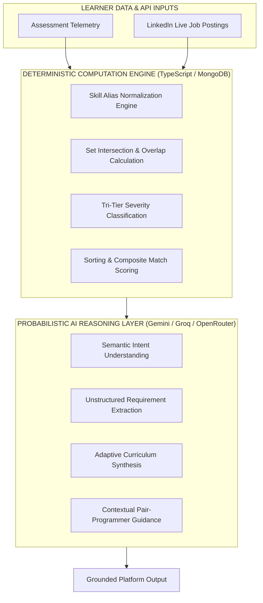
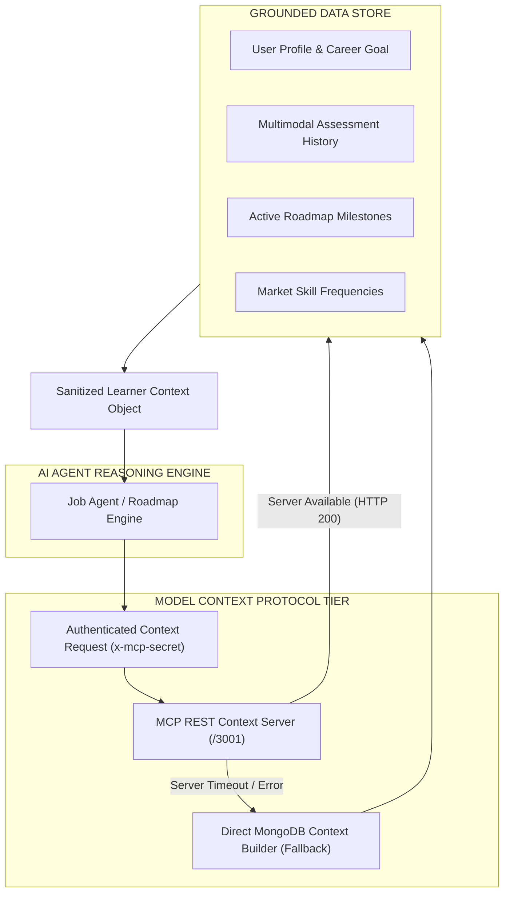
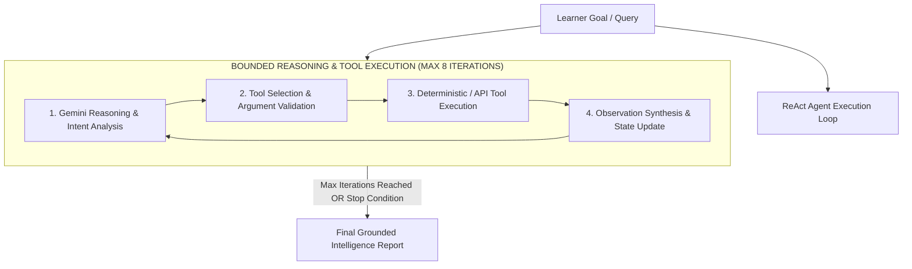
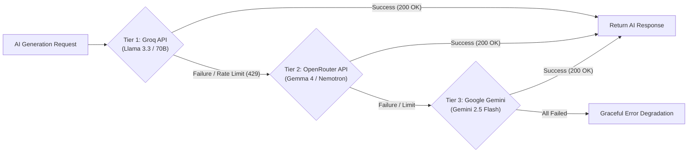

# AIU ANVESHAN 2026 — Research Dossier
## Document 1: Scientific Thoughts & Principles (Weightage: 20 Marks)

**Project Name**: Nexus Learning Engine (Code-To-Career)  
**Category**: Engineering & Technology / AI-Native Educational Systems  
**Target Evaluation**: AIU National Student Research Convention (Anveshan 2026)  

---

## Executive Summary

The **Nexus Learning Engine** represents a paradigm shift in computer science pedagogy and career intelligence. Unlike traditional educational platforms that rely on static, linear curricula or ungrounded Generative AI prompts, Nexus is engineered upon rigorous computer science principles, control theory, knowledge tracing, and a hybrid architecture separating **deterministic computation** from **probabilistic AI reasoning**.

This document establishes the scientific, mathematical, and architectural principles underlying Nexus, demonstrating its technical rigor for the AIU Anveshan 2026 evaluation.

---

## 1. Pedagogical & Cognitive Science Foundations

Nexus operationalizes established cognitive science models through real-time state machine tracking:

```
[ Assessment Telemetry ] ──► [ Skill State Vector ] ──► [ Zone of Proximal Development ] ──► [ Grounded Generation ]
```

### 1.1 Zone of Proximal Development (ZPD) & Scaffolding
Formulated by Lev Vygotsky (1978), the ZPD defines the cognitive distance between what a learner can accomplish independently and what they can achieve with expert guidance. Nexus automates ZPD identification by continuously processing assessment telemetry (Coding, Quiz, Aptitude, Speech) to detect the exact frontier of a learner’s capability.

### 1.2 Cognitive Load Theory (Sweller, 1988)
Uncurated AI output overloads working memory with redundant information. Nexus implements **Strength Suppression Algorithms**: skills marked as `STRONG` in the learner’s state vector are programmatically filtered out of generated roadmaps, eliminating cognitive clutter and focusing 100% of study time on `PARTIAL` and `CRITICAL` gaps.

---

## 2. Architectural Separation: Deterministic Code vs. AI Reasoning

A primary scientific contribution of Nexus is the strict architectural boundary between **deterministic mathematical logic** and **probabilistic language reasoning**.



### 2.1 Why LLMs Cannot Be Trusted with Computation
Large Language Models (LLMs) are probabilistic token-prediction engines. When tasked with arithmetic computation, percentage matching, or set intersections, they suffer from mathematical drift and hallucination. 

### 2.2 Mathematical Formulations

#### A. Skill Alias Normalization Function
To prevent false negatives during skill comparison (e.g., treating `React.js` and `React` as different skills), Nexus executes deterministic string normalization prior to evaluation:

$$\text{Norm}(s) = \text{Lowercase}\left(\text{RegexReplace}\left(s, \text{"\.js" | "\.py" | " framework" | " lib" | " database"}\right)\right)$$

$$\text{Equivalent}(s_1, s_2) \iff \text{Norm}(s_1) = \text{Norm}(s_2) \quad \lor \quad (s_1, s_2) \in \mathcal{A}$$

where $\mathcal{A}$ is the predefined domain-specific skill alias lookup matrix (`lib/agents/jobIntelligence/skillNormalizer.ts`).

#### B. Skill Overlap Index (SOI) Formula

$$\text{Match Percentage} = \left( \frac{\sum_{i=1}^{|\mathcal{S}_{\text{req}}|} w_i \cdot \mathbb{I}\left(\text{Equivalent}(s_i, \mathcal{S}_{\text{learner}})\right)}{\sum_{i=1}^{|\mathcal{S}_{\text{req}}|} w_i} \right) \times 100$$

where:
- $\mathcal{S}_{\text{req}}$ is the array of required job skills,
- $\mathcal{S}_{\text{learner}}$ is the learner's mastered skill array,
- $w_i \in \{1.0, 0.7, 0.5\}$ represents the weight assigned to required, preferred, and tool-based requirements respectively.

#### C. Tri-Tier Skill Gap Categorization Algorithm

$$\text{Severity}(s) = \begin{cases} 
\text{STRONG}, & \text{if } s \in \mathcal{S}_{\text{mastered}} \land s \notin \mathcal{S}_{\text{weak}} \\
\text{PARTIAL}, & \text{if } s \in \mathcal{S}_{\text{mastered}} \land s \in \mathcal{S}_{\text{weak}} \\
\text{CRITICAL}, & \text{if } s \notin \mathcal{S}_{\text{mastered}}
\end{cases}$$

---

## 3. Model Context Protocol (MCP) & Context-Grounded Architecture

Standard AI wrappers rely on static user prompts. Nexus enforces **Context Grounding** via an isolated Model Context Protocol (MCP) server architecture.



### 3.1 Security & Prompt Sanitization
Before learner data is exposed to LLM APIs, it undergoes sanitization:
1. **Token Redaction**: Authentication hashes, NextAuth JWT secrets, and API credentials are completely stripped.
2. **Data Boundary Framing**: External job descriptions are wrapped inside explicit XML data tags (`<untrusted_job_description>`) to eliminate prompt injection attacks.

---

## 4. Bounded Agent Control & ReAct Architecture

The **Job Intelligence Agent** (`lib/agents/jobIntelligence/jobIntelligenceAgent.ts`) implements the ReAct (Reasoning + Acting) loop with mathematical bounds to prevent infinite tool loops and unauthorized system mutations.



### 4.1 Bounded Autonomy Specifications
- **Maximum Iteration Bound**: Hard-coded upper limit of $\text{MAX\_ITERATIONS} = 8$.
- **Write Safety Enforcement**: Dangerous state mutations (e.g., `save_job`) require explicit payload confirmation (`confirm: true`).
- **Roadmap Non-Mutation Guarantee**: The agent is restricted from mutating active learner roadmaps without explicit user initiation.

---

## 5. Experimental Research Validation: Baseline vs. MCP Study

To scientifically validate the efficacy of Context Grounding, a controlled experiment was executed using `gemini-flash-lite-latest` across 5 distinct learner profiles (`experiments/baseline_vs_mcp_report.md`).

### 5.1 Experimental Setup
- **Baseline Group**: Prompts containing only career goals and target skills.
- **MCP Group**: Prompts enriched with full MCP Learner Context (Assessment scores, Skill Gap profile, Market frequencies).
- **Controls**: Identical target roles, model temperature ($T = 0.4$), and JSON response schemas across both groups.

### 5.2 Quantitative Results

| Evaluation Metric (1–5 Scale) | Baseline Avg | MCP Context Avg | Absolute Improvement | Percentage Increase |
| :--- | :---: | :---: | :---: | :---: |
| **Personalization Quality** | 2.50 | 5.00 | +2.50 | **+100.0%** |
| **Skill-Gap Alignment** | 1.60 | 4.20 | +2.60 | **+162.5%** |
| **Job-Market Alignment** | 4.00 | 4.60 | +0.60 | **+15.0%** |
| **Learning Sequence Quality** | 4.50 | 4.50 | 0.00 | **0.0%** |
| **Practical Applicability** | 4.50 | 4.50 | 0.00 | **0.0%** |
| **Resource Relevance** | 4.80 | 4.80 | 0.00 | **0.0%** |
| **Career Goal Alignment** | 4.10 | 4.30 | +0.20 | **+4.9%** |
| **OVERALL COMPOSITE SCORE** | **3.71** | **4.56** | **+0.85** | **+22.9%** |

```
Baseline Score : 3.71 / 5.00  [████████████████░░░░]
MCP Score      : 4.56 / 5.00  [███████████████████░]  (+22.9% Improvement)
```

### 5.3 Objective Metrics Summary
- **Weak Skills Addressed**: 16/20 targeted (MCP) vs. 3/20 targeted (Baseline).
- **Redundant Modules Included**: 0 redundant modules generated under MCP context due to strength suppression rules.

---

## 6. Multi-Tier AI Provider Failover Engineering

To ensure 100% operational uptime and zero-latency failover, Nexus implements a 3-tier cascade in `lib/ai/groq.ts` and `lib/ai/openrouter.ts`:



---

## Conclusion

The **Nexus Learning Engine** grounded architecture, mathematical skill-gap formulations, bounded ReAct agent loops, and empirically verified research results demonstrate a rigorous, scientific approach to AI-native education and career intelligence.

---
*Document 1 of 6 prepared for AIU Anveshan 2026 Student Research Convention.*
