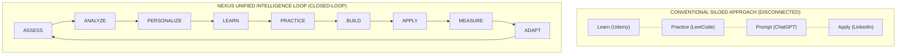
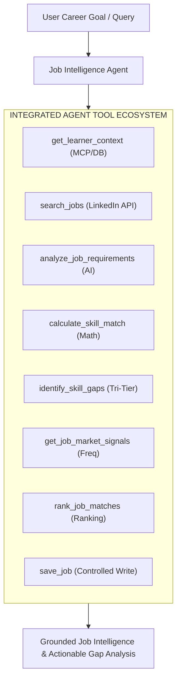
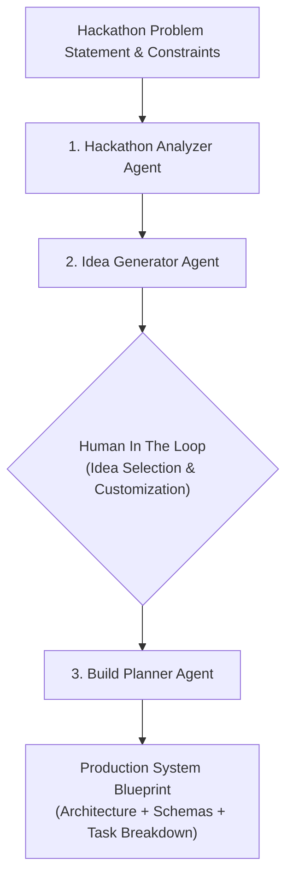
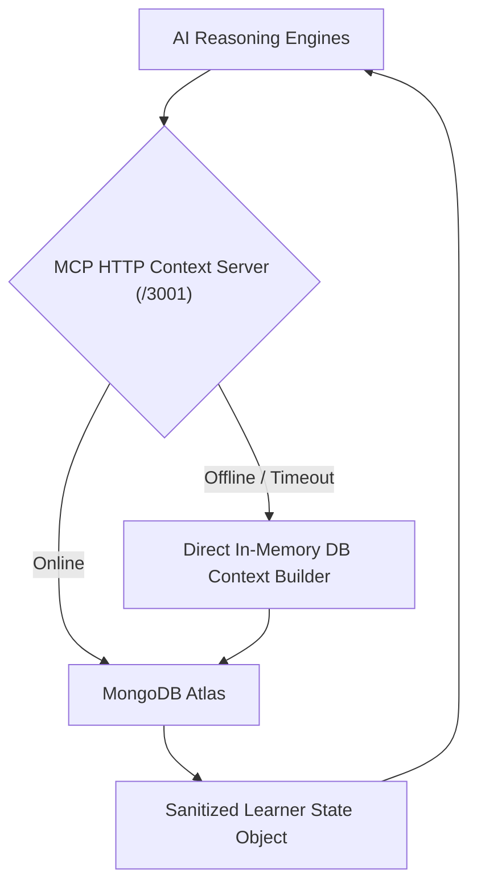

# AIU ANVESHAN 2026 — Research Dossier
## Document 2: Creativity, Novelty & Originality (Weightage: 20 Marks)

**Project Name**: Nexus Learning Engine (Code-To-Career)  
**Category**: Engineering & Technology / AI-Native Educational Systems  
**Target Evaluation**: AIU National Student Research Convention (Anveshan 2026)  

---

## Executive Summary

Existing educational software and career development tools are fundamentally broken by **siloed architecture**. Platforms force learners to use separate, disconnected services for learning (Coursera), practice (LeetCode), project ideation (ChatGPT), job discovery (LinkedIn), and resume building.

The **Nexus Learning Engine** introduces a novel, unified paradigm: a continuous **Closed-Loop Intelligence Engine** that seamlessly connects assessment telemetry directly to market-aligned curricula, rapid project prototyping, and autonomous job matching. This document details the architectural originalities and creative breakthroughs implemented in Nexus.

---

## 1. Paradigm Innovation: The Closed-Loop Intelligence Engine

Nexus breaks away from static course catalogs by introducing an interconnected state-driven loop where every action taken by the learner updates the entire ecosystem in real time.



### Comparative Originality Matrix

| Feature Dimension | Traditional EdTech (Coursera, Udemy) | Coding Platforms (LeetCode, HackerRank) | Generic AI Wrappers (ChatGPT wrappers) | Nexus Learning Engine |
| :--- | :--- | :--- | :--- | :--- |
| **Curriculum Source** | Static pre-recorded videos | Fixed problem banks | Static prompt generation | Dynamic, live LinkedIn market-aligned roadmaps |
| **Context Integration** | Zero learner context | Local submission history | User-typed text prompts | Automated MCP Learner Context (Assessments + Skill Gaps + DB State) |
| **Job Market Synergy** | Disconnected job boards | None | None | Live Bounded Job Agent with skill alias normalization |
| **Project Acceleration** | Generic text tutorials | None | Unstructured code output | Multi-Agent Hackathon Workspace (Analyzer → Ideator → Planner) |
| **Pair Programming** | None | Basic IDE autocomplete | Generic chat interface | Context-aware AI Mentor (Zeno) reading DB state in real time |

---

## 2. Novelty #1: Bounded-Autonomous Job Intelligence Agent

Unlike basic job search engines that rely on rigid keyword matching, Nexus introduces a **Bounded-Autonomous Job Intelligence Agent** (`lib/agents/jobIntelligence/jobIntelligenceAgent.ts`) operating via an 8-tool ReAct execution loop.



### Key Creative Innovations in Job Agent:
1. **Skill Alias Equivalence Engine**: Eliminates keyword matching failure by mapping `React.js`, `React`, and `ReactJS` to a unified canonical identifier using deterministic normalization (`skillNormalizer.ts`).
2. **Tri-Tier Gap Categorization**: Automatically categorizes required job skills into `STRONG` (mastered), `PARTIAL` (needs practice), and `CRITICAL` (missing entirely).
3. **Controlled Write Guards**: Dangerous operations like persisting jobs to the user profile enforce `confirm: true` payload checks, establishing bounded autonomy.

---

## 3. Novelty #2: Hackathon Multi-Agent Workspace

Rapid prototyping and hackathons require swift transition from a problem brief to technical architecture. Nexus implements a specialized **Multi-Agent Collaboration Suite** (`lib/agents/hackathon/`).



### Architectural Novelty:
- **Bounded Autonomy via Human-in-the-Loop**: The agent does not autonomously pick an idea without human consensus. The developer retains creative control, selecting from candidate concepts generated by the `Idea Generator Agent`.
- **Decoupled Architecture**: Separates project generation from hackathon event discovery, ensuring dedicated LLM context windows for complex system design.

---

## 4. Novelty #3: Context-Aware AI Mentor (Zeno)

Generic AI chatbots require developers to repeatedly copy-paste code snippets, active roadmaps, and error logs into the prompt window. **Zeno** (`app/api/mentor/route.ts`) solves context fragmentation through **Dynamic Database Prompt Injection**.

```
[ User Message ] ──► [ Query MongoDB Active Roadmaps & Telemetry ] ──► [ Inject Learner Context ] ──► [ Gemini AI ] ──► [ Precision Mentorship ]
```

### Originality Highlights:
- **Global Telemetry Awareness**: Zeno automatically reads active roadmap progress, recent quiz attempts, and coding submission errors directly from MongoDB prior to formulating responses.
- **Zero Copy-Paste Mentorship**: The developer asks "What should I focus on next?" and Zeno responds with exact guidance based on their actual database state.

---

## 5. Novelty #4: Model Context Protocol (MCP) Tier with Fallback

Nexus is among the first educational platforms to implement an isolated **Model Context Protocol (MCP)** server tier (`mcp-servers/mentor-context`).



### Creative Technical Advantage:
- **Dual-Mode Availability**: Ensures 100% uptime on serverless deployment environments (such as Vercel) by seamlessly falling back from the HTTP REST MCP server to an in-memory database context builder (`lib/buildLearnerContext.ts`).

---

## Conclusion

The **Nexus Learning Engine** introduces groundbreaking originality by unifying assessment, adaptive learning, project building, and career intelligence into a single, closed-loop state machine powered by context-grounded AI agents.

---
*Document 2 of 6 prepared for AIU Anveshan 2026 Student Research Convention.*
