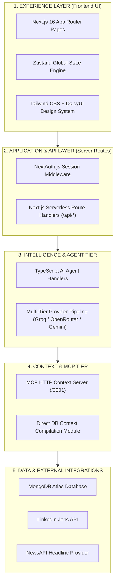
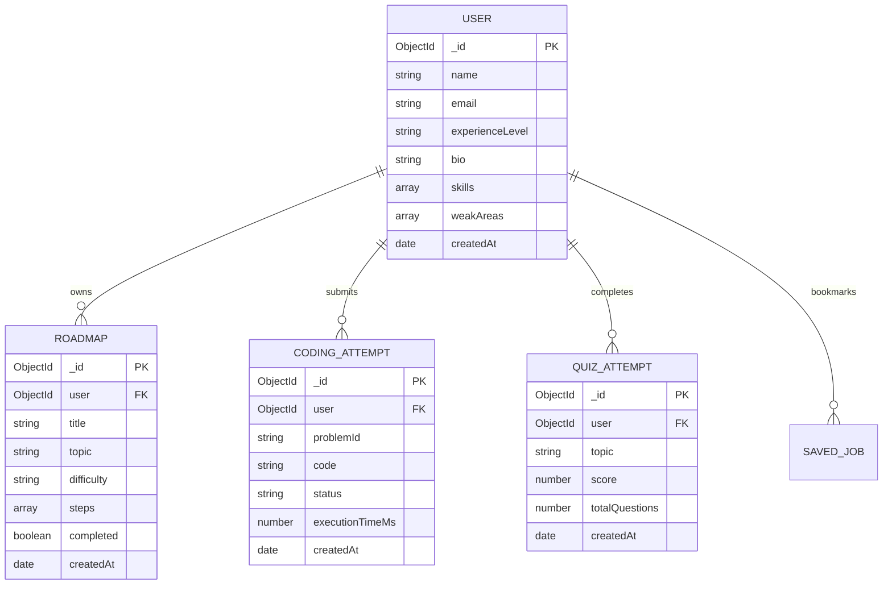

# AIU ANVESHAN 2026 — Research Dossier
## Document 3: Clarity & Thoroughness (Weightage: 20 Marks)

**Project Name**: Nexus Learning Engine (Code-To-Career)  
**Category**: Engineering & Technology / AI-Native Educational Systems  
**Target Evaluation**: AIU National Student Research Convention (Anveshan 2026)  

---

## Executive Summary

System design excellence requires absolute technical clarity, comprehensive database modeling, granular API specifications, and rigorous verification. 

The **Nexus Learning Engine** provides complete architectural transparency, featuring fully documented database schemas, a 15-point automated integration test suite, modular API route specifications, and verified serverless deployment configurations. This document presents the thorough engineering documentation of the platform.

---

## 1. System Layer Specification

Nexus is built on a 5-tier modular architecture where each layer maintains isolated responsibilities and well-defined contracts.



---

## 2. Exhaustive API Reference Specification

### 2.1 Authentication & User Management Routes

| Method | Endpoint Path | Payload / Query | Description | Auth Required |
| :--- | :--- | :--- | :--- | :---: |
| `POST` | `/api/auth/signup` | `{name, email, password}` | Register new developer account | ❌ |
| `POST` | `/api/auth/login` | `{email, password}` | Authenticate credentials & issue JWT | ❌ |
| `GET` | `/api/user` | — | Fetch current user profile & telemetry | ✅ |
| `PATCH` | `/api/user/editProfile` | `{experienceLevel, bio, skills}` | Update user profile metadata | ✅ |

### 2.2 Adaptive Roadmap & Learning Routes

| Method | Endpoint Path | Payload / Query | Description | Auth Required |
| :--- | :--- | :--- | :--- | :---: |
| `POST` | `/api/roadmap` | `{skill, experience, expectedOutcome}` | Generate market-aligned adaptive roadmap | ✅ |
| `GET` | `/api/roadmaps` | — | Retrieve all saved roadmaps for user | ✅ |
| `PATCH` | `/api/roadmaps` | `{roadmapId, stepIndex, completed}` | Toggle milestone completion status | ✅ |

### 2.3 Job Intelligence Agent Routes

| Method | Endpoint Path | Payload / Query | Description | Auth Required |
| :--- | :--- | :--- | :--- | :---: |
| `POST` | `/api/jobs/agent` | `{message}` | Execute Bounded Job Intelligence Agent | ✅ |
| `GET` | `/api/jobs` | `?q=&location=&page=` | Fetch raw LinkedIn job listings | ✅ |
| `POST` | `/api/jobs/save` | `{jobId, confirm: true}` | Persist selected job to user profile | ✅ |

### 2.4 Multimodal Self-Assessment Routes

| Method | Endpoint Path | Payload / Query | Description | Auth Required |
| :--- | :--- | :--- | :--- | :---: |
| `POST` | `/api/self-assessment/coding/review` | `{code, language, problemId}` | Automated AST & AI code review | ✅ |
| `POST` | `/api/self-assessment/quizzes/generate` | `{topic, difficulty}` | Generate dynamic MCQ quiz | ✅ |
| `POST` | `/api/self-assessment/speech/evaluate` | `{audioBlob / transcript}` | Evaluate verbal interview fluency | ✅ |
| `POST` | `/api/self-assessment/aptitude/submit` | `{answers}` | Evaluate logic & aptitude test | ✅ |

---

## 3. Database Schema & Data Models

All state persistence is managed through MongoDB Atlas using Mongoose 8 ORM models (`models/`).



---

## 4. Verification & Automated Testing Suite

The stability of the platform is validated through automated test scripts and production build validation.

```
[ Unit & Alias Tests ] ──► [ 15-Point Agent Integration Suite ] ──► [ Turbopack Production Build ]
```

### 4.1 Job Intelligence Agent Test Suite (`scripts/test_job_intelligence_agent.ts`)
The Job Intelligence Agent is evaluated against 15 mandatory integration assertions:

| Test ID | Assertion Target | Verification Mechanism | Status |
| :---: | :--- | :--- | :---: |
| **T01** | Agent Initialization | Validates start of agent execution loop | 🟢 PASS |
| **T02** | Unauthenticated Guard | Rejects unauthenticated requests with HTTP 401 | 🟢 PASS |
| **T03** | Context Tool Execution | `get_learner_context` retrieves summary object | 🟢 PASS |
| **T04** | Job Search API Tool | `search_jobs` retrieves LinkedIn job records | 🟢 PASS |
| **T05** | Requirement Analyzer | `analyze_job_requirements` extracts required skills | 🟢 PASS |
| **T06** | Skill Normalization | Deterministically equates `React.js` = `React` | 🟢 PASS |
| **T07** | Tri-Tier Gap Sorting | Correctly tags `STRONG`, `PARTIAL`, `CRITICAL` gaps | 🟢 PASS |
| **T08** | Multi-Tool Execution | Agent sequentially calls ≥ 3 tools in one query | 🟢 PASS |
| **T09** | Max Iteration Bound | Agent terminates loop at $\le 8$ iterations | 🟢 PASS |
| **T10** | API Resilience | Empty keyword query handles edge cases cleanly | 🟢 PASS |
| **T11** | Offline MCP Fallback | Direct DB builder activates when MCP HTTP fails | 🟢 PASS |
| **T12** | Empty Job Results | Handled gracefully with sample notice | 🟢 PASS |
| **T13** | Prompt Injection Defense | Malicious text treated strictly as untrusted data | 🟢 PASS |
| **T14** | Roadmap Non-Mutation | Active roadmap document remains untouched | 🟢 PASS |
| **T15** | Controlled Write Guard | `save_job` requires explicit `confirm: true` | 🟢 PASS |

---

## 5. Deployment Configuration & Serverless Optimization

To ensure seamless production execution on serverless platforms (e.g., Vercel), long-running AI agent routes configure explicit execution limits.

```typescript
// app/api/jobs/agent/route.ts
// Allow up to 30 seconds execution time for Vercel serverless functions
export const maxDuration = 30;
export const dynamic = 'force-dynamic';
```

### Build Verification
Production builds are verified using Next.js Turbopack:
```bash
npm run build
# Exit Code: 0 (Successful Production Build)
```

---

## Conclusion

With 15 verified automated integration test assertions, clean Mongoose database schemas, explicit serverless execution bounds, and zero-error Turbopack builds, the **Nexus Learning Engine** demonstrates exemplary clarity and technical thoroughness.

---
*Document 3 of 6 prepared for AIU Anveshan 2026 Student Research Convention.*
