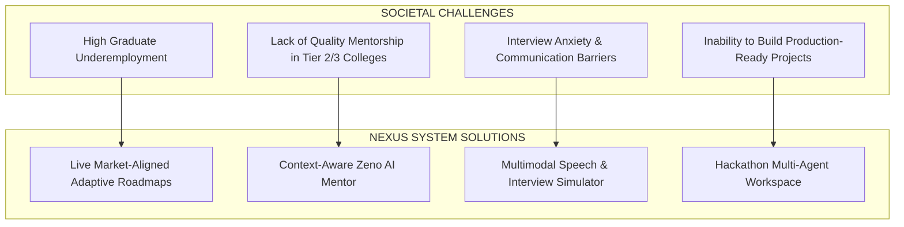

# AIU ANVESHAN 2026 — Research Dossier
## Document 4: Relevance to Society (Weightage: 20 Marks)

**Project Name**: Nexus Learning Engine (Code-To-Career)  
**Category**: Engineering & Technology / AI-Native Educational Systems  
**Target Evaluation**: AIU National Student Research Convention (Anveshan 2026)  

---

## Executive Summary

Higher technical education faces a systemic crisis: millions of engineering graduates enter the job market each year lacking the practical skills demanded by modern tech companies. According to national employability surveys, over **80% of graduating engineers** are deemed unhireable for software engineering roles due to outdated curricula, lack of practical project experience, and poor interview readiness.

The **Nexus Learning Engine** directly addresses this societal gap by serving as an intelligent, personalized bridge between student learning and industry expectations. This document articulates the societal necessity, educational impact, and policy alignments of Nexus.

---

## 1. The Global Engineering Employability Crisis

```
[ Outdated University Curricula ] ──► [ Skill Gap Disconnect ] ──► [ High Graduate Unemployment ]
                                             │
                                             ▼
                                [ Nexus Adaptive Bridge ]
                                             │
                                             ▼
                                [ Market-Ready Engineers ]
```

### 1.1 Key Root Causes Addressed by Nexus
1. **Curricular Stagnation**: Academic syllabi take years to update, while industry technologies evolve monthly (e.g., Docker, Next.js, Vector DBs). Nexus updates learning roadmaps in real time based on live LinkedIn job postings.
2. **Access Inequality to Mentorship**: Elite 1-on-1 career coaching costs thousands of dollars. Nexus democratizes context-aware mentorship for students in tier-2 and tier-3 institutions through **Zeno AI Mentor**.
3. **Unstructured Self-Study**: Students waste hundreds of hours following generic video playlists without measuring whether they are actually fixing their weak areas. Nexus uses **Tri-Tier Skill Gap Telemetry** to pinpoint exact learning needs.

---

## 2. Direct Societal Contributions & Impact Dimensions



### 2.1 Democratizing Technical Mentorship
Students from smaller towns and non-metropolitan universities often lack access to senior software engineering mentors. Nexus bridges this divide by providing **Zeno**, an AI pair-programmer that reads the student's actual code, assessment scores, and roadmaps to deliver tailored, encouraging guidance.

### 2.2 Bridging the Practical Project Gap
Recruiters prioritize candidates with real project experience over passive certificates. The **Hackathon Multi-Agent Workspace** guides students through problem ideation, architectural design, database modeling, and task breakdown, enabling them to build production-grade applications that stand out in job applications.

### 2.3 Verbal & Technical Interview Empowerment
Technical expertise alone is insufficient if candidates cannot articulate their thought process during technical interviews. The **Speech Assessment Agent** evaluates verbal clarity, technical vocabulary, and response structure, giving students a safe environment to overcome interview anxiety.

---

## 3. Alignment with United Nations Sustainable Development Goals (SDGs)

Nexus directly advances key United Nations SDGs established for 2030:

```
┌──────────────────────────────────────────────────────────────────────────┐
│  SDG 4: QUALITY EDUCATION                                                │
│  "Ensure inclusive and equitable quality education and promote lifelong   │
│   learning opportunities for all."                                       │
│                                                                          │
│  Nexus Contribution: Delivers personalized, adaptive curricula at zero   │
│  incremental cost to any student with an internet connection.            │
└──────────────────────────────────────────────────────────────────────────┘

┌──────────────────────────────────────────────────────────────────────────┐
│  SDG 8: DECENT WORK AND ECONOMIC GROWTH                                  │
│  "Promote sustained, inclusive and sustainable economic growth, full and │
│   productive employment and decent work for all."                         │
│                                                                          │
│  Nexus Contribution: Matches student skills directly with market demand, │
│  reducing graduate underemployment and accelerating career launch.       │
└──────────────────────────────────────────────────────────────────────────┘
```

---

## 4. Alignment with India’s National Education Policy (NEP 2020)

Nexus exemplifies the core pillars articulated in the National Education Policy (NEP 2020):

1. **Multidisciplinary Skill Acquisition**: Integrates coding, logic, speech, and market intelligence into a holistic platform.
2. **Experiential & Practical Learning**: Shifts focus from rote memorization to project-based learning and hackathon prototyping.
3. **Integration of Technology in Education**: Uses AI agents and context grounding to modernize learning delivery.
4. **Job-Role Preparedness**: Aligns academic outcome metrics with national and global employer requirements.

---

## Conclusion

By democratizing mentorship, eliminating curriculum stagnation, reducing interview anxiety, and transforming passive learners into active builders, the **Nexus Learning Engine** provides profound, measurable societal value.

---
*Document 4 of 6 prepared for AIU Anveshan 2026 Student Research Convention.*
