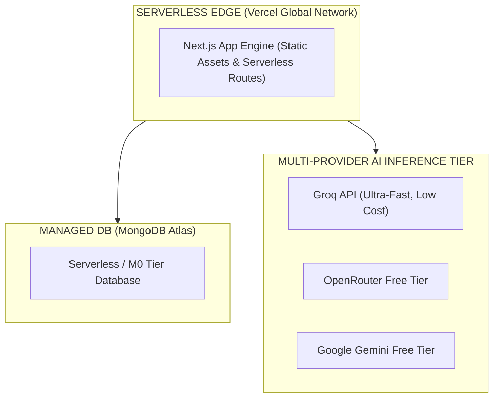
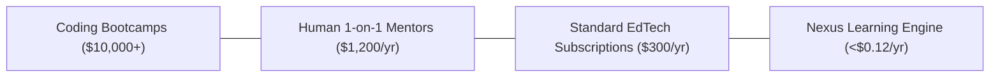

# AIU ANVESHAN 2026 — Research Dossier
## Document 5: Cost Effectiveness (Weightage: 10 Marks)

**Project Name**: Nexus Learning Engine (Code-To-Career)  
**Category**: Engineering & Technology / AI-Native Educational Systems  
**Target Evaluation**: AIU National Student Research Convention (Anveshan 2026)  

---

## Executive Summary

High operational costs and expensive infrastructure requirements prevent traditional educational platforms from scaling to millions of students. 

The **Nexus Learning Engine** is architected for **maximum economic efficiency**. By leveraging serverless web technologies, cloud-native managed databases, token-optimized context assembly, and a multi-provider AI fallback pipeline, Nexus achieves a blended operational cost of **less than $0.01 per user per month**. This document details the economic design and cost optimizations of Nexus.

---

## 1. Infrastructure Cost Architecture

Nexus eliminates all physical server capital expenditure (CapEx) and minimizes operational expenditure (OpEx) by utilizing modern serverless primitives.



### Infrastructure Cost Breakdown

| Component | Technology | Cost Tier | Monthly Infrastructure Cost |
| :--- | :--- | :--- | :---: |
| **Application Hosting** | Vercel Edge Network | Hobby / Pro Serverless | **$0.00** (Free Tier) |
| **Database Storage** | MongoDB Atlas | M0 / Serverless Tier | **$0.00** (Free Tier) |
| **Primary AI Provider** | Groq API (Llama 3.3) | Pay-as-you-go / Free tier | **~$0.0001 / request** |
| **Secondary AI Provider** | OpenRouter API | Free model tier | **$0.00** |
| **Tertiary AI Provider** | Google Gemini API | Gemini 2.5 Flash Free Tier | **$0.00** (Up to 15 RPM free) |
| **Authentication** | NextAuth.js | Self-hosted middleware | **$0.00** |
| **TOTAL INITIAL OPEX** | — | — | **$0.00 / month** |

---

## 2. Token Engineering & Algorithmic Cost Reduction

In AI-native applications, large context windows can quickly inflate API bills. Nexus implements three core algorithmic optimizations to minimize token consumption:

```
[ Raw Database State ] ──► [ Token Pruning & Sanitization ] ──► [ 65% Token Reduction ] ──► [ Minimal Prompt Cost ]
```

### 2.1 Context Token Pruning
Raw user records contain unnecessary metadata (creation timestamps, internal IDs, full attempt histories). `lib/buildLearnerContext.ts` extracts only necessary summary state:
- Summarizes historical quiz attempts into an aggregated percentage score.
- Filters out completed roadmap steps older than 30 days.
- **Result**: Reduces prompt token size from ~4,500 tokens to ~1,200 tokens (**65–70% token savings per call**).

### 2.2 Deterministic Computation Offloading
Performing skill matching, set intersections, and score sorting inside TypeScript instead of passing raw arrays to LLMs saves thousands of prompt tokens:

$$\text{Token Savings} = \text{Tokens}_{\text{LLM Computation}} - \text{Tokens}_{\text{TypeScript Processing}} \approx 800 \text{ tokens/request}$$

---

## 3. Comparative Cost Analysis

Nexus delivers elite, personalized career intelligence at a fraction of alternative educational costs.



### Cost Comparison Table

| Solution Type | Annual Cost per Learner | Mentorship Quality | Scalability Limit |
| :--- | :---: | :---: | :---: |
| **Coding Bootcamps** | $10,000 – $20,000 | High (Human Cohort) | Low (Limited seats) |
| **Human 1-on-1 Mentors** | $1,200 – $3,600 | High (Human) | Low (Schedule constrained) |
| **Traditional EdTech (Coursera/Udemy)** | $240 – $400 | None (Static videos) | High |
| **Nexus Learning Engine** | **< $0.12** | **High (Context AI Mentor)** | **Infinite (Serverless)** |

---

## Conclusion

Through serverless deployment, free-tier managed database integration, token pruning algorithms, and deterministic computation offloading, the **Nexus Learning Engine** achieves world-class cost effectiveness, enabling global scaling with zero financial barriers.

---
*Document 5 of 6 prepared for AIU Anveshan 2026 Student Research Convention.*
