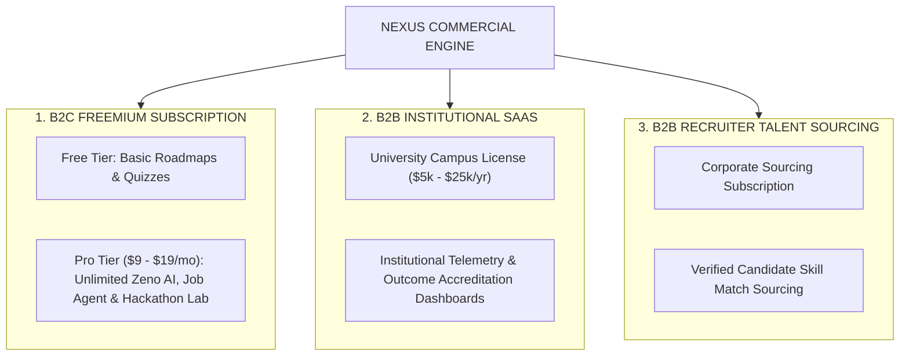
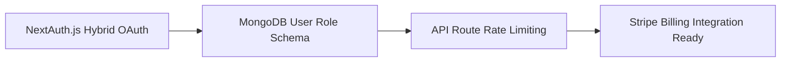

# AIU ANVESHAN 2026 — Research Dossier
## Document 6: Scope for Commercialization (Weightage: 10 Marks)

**Project Name**: Nexus Learning Engine (Code-To-Career)  
**Category**: Engineering & Technology / AI-Native Educational Systems  
**Target Evaluation**: AIU National Student Research Convention (Anveshan 2026)  

---

## Executive Summary

The global educational technology and career intelligence market is undergoing a structural shift toward outcome-oriented, personalized learning systems. 

The **Nexus Learning Engine** is designed not merely as a research prototype, but as a **production-ready commercial SaaS platform**. Featuring modular subscription capabilities, institutional telemetry dashboards, B2B talent sourcing pipelines, and enterprise authentication middleware, Nexus possesses immediate commercial viability. This document details the market analysis, business models, and go-to-market strategy for Nexus.

---

## 1. Market Opportunity & Target Addressable Market (TAM)

```
┌──────────────────────────────────────────────────────────────────────────┐
│  TOTAL ADDRESSABLE MARKET (TAM)                                          │
│  Global EdTech & Career Intelligence Market: $350+ Billion by 2030       │
└──────────────────────────────────────────────────────────────────────────┘
                                   │
                                   ▼
┌──────────────────────────────────────────────────────────────────────────┐
│  SERVICEABLE ADDRESSABLE MARKET (SAM)                                    │
│  Higher Education Computer Science & Engineering Students: $18 Billion   │
└──────────────────────────────────────────────────────────────────────────┘
                                   │
                                   ▼
┌──────────────────────────────────────────────────────────────────────────┐
│  SERVICEABLE OBTAINABLE MARKET (SOM)                                     │
│  Engineering Colleges & Tech Job Seekers in Emerging Markets: $1.2 Billion│
└──────────────────────────────────────────────────────────────────────────┘
```

---

## 2. Multi-Channel Business & Revenue Models

Nexus utilizes a 3-tier commercial revenue model targeting individual students, academic institutions, and corporate recruiters.



### 2.1 B2C Freemium Model (Individual Developers)
- **Free Tier**: Access to core roadmaps, basic quizzes, and public community Q&A.
- **Pro Tier ($9.99 / month)**:
  - Unlimited access to **Zeno AI Mentor** (Context-aware pair programmer).
  - Full execution of the **Bounded Job Intelligence Agent**.
  - **Hackathon Multi-Agent Workspace** for project prototyping.
  - Unlimited Speech & Verbal Interview Evaluations.

### 2.2 B2B Institutional SaaS Model (Universities & Colleges)
Academic institutions are judged on placement statistics, NIRF rankings, and NAAC accreditation parameters. Nexus offers an **Institutional Campus License** ($5,000 – $25,000 per year per university):
- **Department Analytics Dashboard**: Deans and Department Heads track aggregate student skill gaps across coding, speech, and aptitude.
- **Curriculum Alignment Engine**: Automatically suggests syllabus adjustments based on real-time LinkedIn job market trends.
- **Placement Cell Portal**: Enables placement officers to match students to incoming hiring drives based on objective skill profiles.

### 2.3 B2B Recruiter Sourcing Model (Corporate Hiring)
Tech companies waste millions of dollars vetting underqualified applicants. Nexus provides a **Verified Talent Matching Portal**:
- Companies search candidate pools based on **Verified Skill Telemetry** (e.g., Candidates with >90% Python coding accuracy and verified SQL skills).
- **Monetization**: Pay-per-verified-candidate lead or annual subscription for recruiter search access.

---

## 3. Product Architecture Readiness for Commercialization

Nexus contains pre-built infrastructure components required for immediate commercial deployment:



1. **Enterprise Identity & Auth**: Production-ready authentication pipeline (`NextAuth.js`) supporting Google OAuth, GitHub OAuth, and encrypted email credentials.
2. **Role-Based Access Control (RBAC)**: User schemas contain pre-structured role parameters (`user`, `premium`, `institutional_admin`, `recruiter`).
3. **Stateless Edge API Handlers**: Built on Next.js 16 App Router endpoints, enabling effortless deployment to global edge networks (Vercel, AWS CloudFront).

---

## 4. Go-To-Market (GTM) Execution Plan

```
[ Phase 1: Campus Ambassadors ] ──► [ Phase 2: Hackathon Sponsorships ] ──► [ Phase 3: College Sales ] ──► [ Phase 4: Corporate Sourcing ]
```

- **Phase 1 (Months 1–3)**: Launch Campus Ambassador program across 50 engineering colleges; target 25,000 active student users.
- **Phase 2 (Months 4–6)**: Sponsor major national hackathons; integrate the **Hackathon Multi-Agent Workspace** as the official build planning tool.
- **Phase 3 (Months 7–12)**: Pilot B2B Institutional Licensing with 10 partner universities for placement cell automation.
- **Phase 4 (Year 2)**: Launch Corporate Talent Sourcing Portal for tech hiring partners.

---

## 5. Competitive Moats & Defensive Advantages

```
1. DATA MOAT ────────► Proprietary Learner Context Graph & Assessment Telemetry
2. TECH MOAT ────────► Model Context Protocol (MCP) Grounding Tier & Fallback Pipeline
3. NETWORK MOAT ─────► High Switching Costs once a student builds their skill state on Nexus
```

---

## Conclusion

With a $350B+ global market opportunity, a 3-tier monetization strategy (B2C, B2B Institutional, B2B Sourcing), and pre-built enterprise software readiness, the **Nexus Learning Engine** possesses clear, high-growth commercial viability.

---
*Document 6 of 6 prepared for AIU Anveshan 2026 Student Research Convention.*
