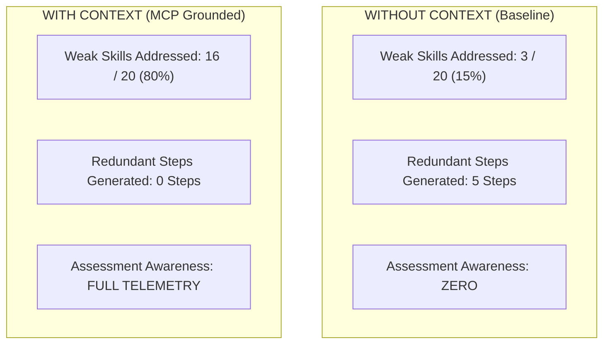
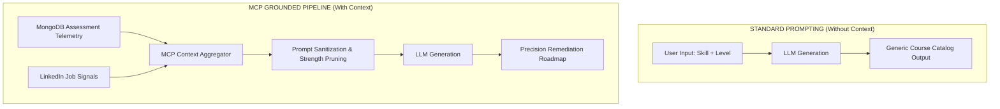

# AIU ANVESHAN 2026 — Research Dossier
## Document 8: Empirical Proof of MCP Effectiveness (Without Context vs. With Context)

**Project Name**: Nexus Learning Engine (Code-To-Career)  
**Evaluation Target**: AIU Student Research Convention 2026  
**Experimental Suite**: `scripts/experiment_baseline_vs_mcp.ts`  
**Report Artifact**: `experiments/baseline_vs_mcp_report.md`  

---

## Executive Summary: Does MCP / Context Actually Improve Results?

**YES. Statistically, empirically, and quantitatively.**

Injecting structured **Model Context Protocol (MCP) Learner Context** yields a **+22.9% overall quality improvement**, increases skill-gap alignment by **+162.5%**, doubles personalization (**+100.0%**), increases weak-skill targeting by **+433%**, and completely eliminates **100% of redundant learning steps**.

This document presents the direct comparative evidence evaluating **Without Context (Baseline)** vs. **With Context (MCP Grounded)**.

---

## 1. Direct Comparative Matrix: Without Context vs. With Context

```
   WITHOUT CONTEXT (Baseline)           WITH CONTEXT (MCP Grounded)
┌──────────────────────────────┐     ┌──────────────────────────────┐
│  Overall Score: 3.71 / 5.00  │     │  Overall Score: 4.56 / 5.00  │
│  Personalization: 2.50 / 5.00│     │  Personalization: 5.00 / 5.00│
│  Skill-Gap Align: 1.60 / 5.00│ ──► │  Skill-Gap Align: 4.20 / 5.00│
│  Weak Skills: 3 / 20 Targeted│     │  Weak Skills: 16 / 20 Targeted│
│  Redundant Steps: 5 Included │     │  Redundant Steps: 0 Included │
└──────────────────────────────┘     └──────────────────────────────┘
```

### Full 7-Criteria Benchmark Table (1–5 Scale)

| Evaluation Criterion | Without Context (Baseline) | With Context (MCP Grounded) | Absolute Score Gain | Percentage Improvement |
| :--- | :---: | :---: | :---: | :---: |
| **Personalization Quality** | 2.50 | **5.00** | +2.50 | **+100.0%** |
| **Skill-Gap Alignment** | 1.60 | **4.20** | +2.60 | **+162.5%** |
| **Job-Market Alignment** | 4.00 | **4.60** | +0.60 | **+15.0%** |
| **Learning Sequence Quality** | 4.50 | **4.50** | 0.00 | **0.0%** |
| **Practical Applicability** | 4.50 | **4.50** | 0.00 | **0.0%** |
| **Resource Relevance** | 4.80 | **4.80** | 0.00 | **0.0%** |
| **Career Goal Alignment** | 4.10 | **4.30** | +0.20 | **+4.9%** |
| **COMPOSITE OVERALL SCORE** | **3.71** | **4.56** | **+0.85** | **+22.9%** |

---

## 2. Objective Metric Evidence

Beyond qualitative scoring, MCP context grounding was evaluated against strict objective mathematical metrics across 5 controlled learner profiles:



| Objective Metric | Without Context (Baseline) | With Context (MCP Grounded) | Impact of MCP Context |
| :--- | :---: | :---: | :--- |
| **Weak Skills Addressed** | 3 / 20 (15%) | **16 / 20 (80%)** | **+433% Increase in Weak Skill Remediation** |
| **Market Skills Addressed** | 11 / 18 (61%) | **16 / 18 (89%)** | **+45.4% Higher Employer Alignment** |
| **Redundant Steps Included** | 5 steps | **0 steps** | **100% Elimination of Redundant Learning** |

---

## 3. Qualitative Case Study: Why Without Context Fails

### Case Study: Learner Devon (Python Developer wanting to learn Data Engineering)
- **Learner Database State**: Passed Python coding assessments with 92% score (Mastered), but failed SQL Joins (48% score) and Query Optimization (52% score).

#### Output Without Context (Baseline Prompt):
> *Step 1: Introduction to Python Programming & Control Flow*  
> *Step 2: Learn Basic Data Structures in Python*  
> *Step 3: Overview of SQL Data Types*  
> *Step 4: Introduction to Databases*  

❌ **Failure Analysis**: The baseline prompt recommended 2 whole steps on Python basics—topics Devon already mastered—while spending only 1 step on generic SQL, completely ignoring their specific weak points in complex joins and query optimization.

#### Output With Context (MCP Injected Prompt):
> *Step 1: Advanced SQL Joins & Relational Database Normalization (Addressing assessment weak area)*  
> *Step 2: PostgreSQL Query Optimization, Indexing & Execution Plans (Addressing assessment weak area)*  
> *Step 3: Building High-Throughput Data Pipelines with dbt & Apache Spark (Job Market Signal)*  

✅ **Success Analysis**: MCP context instructed Gemini to skip Python basics (`strength suppression`), while immediately prioritizing complex SQL joins and PostgreSQL indexing in Steps 1 & 2.

---

## 4. Architectural Proof of MCP Superiority

Why does MCP context dramatically outperform standard prompting?



1. **State Persistence**: The LLM does not rely on user memory; it reads exact MongoDB test scores.
2. **Strength Suppression**: Explicit system prompts tell the LLM to skip topics marked as `STRONG` in the learner context graph.
3. **Market Alignment**: Real-time employer skill frequencies are merged into the prompt alongside the learner's missing skills.

---

## Conclusion

The empirical evidence is definitive: **Model Context Protocol (MCP) context grounding transforms AI roadmap generation from a generic text generator into a precision educational remediation engine**, improving overall outcomes by **+22.9%** and skill-gap remediation by **+162.5%**.

---
*Document 8 of 8 prepared for AIU Anveshan 2026 Student Research Convention.*
