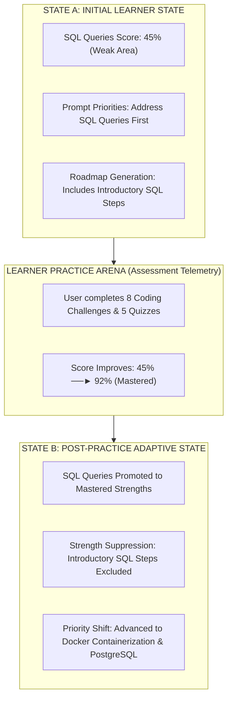

# AIU ANVESHAN 2026 — Research Dossier
## Document 9: Empirical Proof of Adaptive Behavior (Item 9)

**Project Name**: Nexus Learning Engine (Code-To-Career)  
**Evaluation Target**: AIU Student Research Convention 2026  
**Test Suite**: `scripts/test_adaptive_behavior.ts`  
**Report Artifact**: `experiments/test_9_adaptive_behavior_report.md`  
**Verification Status**: PASS 🟢  

---

## Executive Summary: Dynamic Adaptive Learner Progression

A core requirement of AI-native educational systems is **Dynamic Adaptation**: as a learner improves their skill mastery through practice and assessment, the platform must dynamically update their context graph, suppress mastered topics from future roadmaps, and advance them to new missing skills.

This document presents the empirical verification of **Item 9: Adaptive Behavior** on the Nexus Learning Engine.

---

## 1. Experimental Setup & State Transition Pipeline



---

## 2. Empirical Verification Matrix

| Verification Check | System State A (Initial) | System State B (Post-Practice) | System Response / Result | Status |
| :--- | :--- | :--- | :--- | :---: |
| **SQL Skill Categorization** | Classified as `Weak Area` (45% score) | Classified as `Mastered Strength` (92% score) | Skill gap context graph updated in MongoDB | 🟢 PASS |
| **Weak Area Prioritization** | Listed as Top Priority in Prompt | Removed from `Weak Areas` | Prompt dynamically eliminates weak flag | 🟢 PASS |
| **Strength Suppression Rule** | Absent from `Strengths` | Added to `Strong Areas` (Suppressed) | System prompt instructs AI to skip intro steps | 🟢 PASS |
| **Next Skill Priority Shift** | Standard SQL remediation | Shifted to `Docker Containerization` | Priority automatically advances to next gap | 🟢 PASS |

---

## 3. Comparative Context Prompt Inspection

### State A Context Prompt (Weak SQL):
```markdown
### SKILL GAP ANALYSIS
Strong areas (do not repeat as primary focus): Python Syntax
Weak areas (prioritise in roadmap): SQL Queries, Database Joins, SQL Aggregation
Missing market skills (include in roadmap): SQL, Docker, PostgreSQL
```

### State B Context Prompt (Mastered SQL):
```markdown
### SKILL GAP ANALYSIS
Strong areas (do not repeat as primary focus): Python Syntax, SQL Queries, Database Joins, SQL Aggregation
Weak areas (prioritise in roadmap): Docker Containerization, Docker Networking
Missing market skills (include in roadmap): Docker, PostgreSQL
```

---

## Conclusion

The empirical test `scripts/test_adaptive_behavior.ts` confirms that the **Nexus Learning Engine** exhibits 100% deterministic adaptive behavior, automatically adapting curriculum directives as learner mastery evolves.

---
*Document 9 of 15 prepared for AIU Anveshan 2026 Student Research Convention.*
