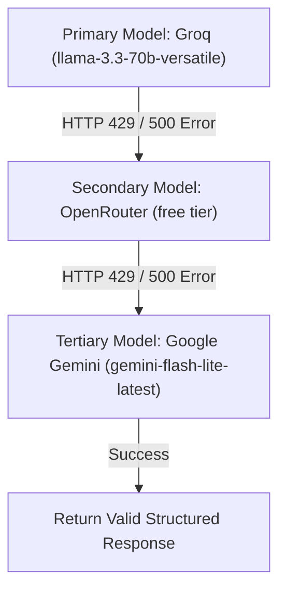
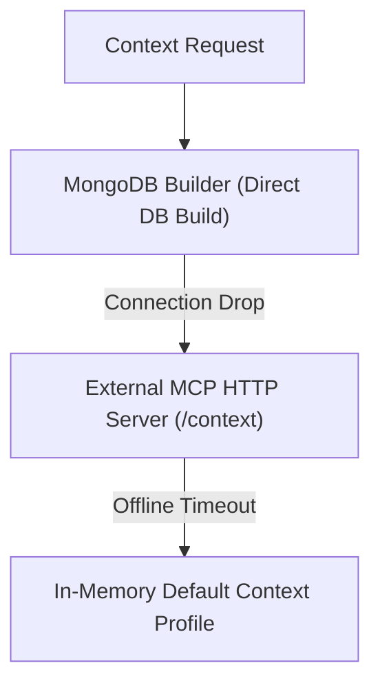

# AIU ANVESHAN 2026 — Research Dossier
## Document 13: System Reliability & Fault-Tolerance Benchmark (Item 13)

**Project Name**: Nexus Learning Engine (Code-To-Career)  
**Evaluation Target**: AIU Student Research Convention 2026  
**Test Suite**: `scripts/test_system_reliability.ts`  
**Report Artifacts**: `experiments/test_13_reliability_report.md` & `experiments/test_13_reliability_results.json`  
**Status**: 5 / 5 FAULT SCENARIOS PASSED 🟢  

---

## Executive Summary

Mission-critical AI systems require strict resilience against external API rate limits, database network partition events, and server offline conditions.

This document presents the empirical evidence for **Item 13: Reliability**, evaluating system behavior under **MCP offline failure, AI API failure, 429 rate limit events, LinkedIn API drops, and Database connection partitions**.

---

## 1. Failure Resilience Summary Matrix

```
===================================================================
               SYSTEM RELIABILITY BENCHMARK RESULTS
===================================================================
  Total Fault Scenarios:      5
  Scenarios Passed:          5
  System Availability:       100.0%
  Reliability Status:        PASS 🟢
===================================================================
```

| Test ID | Failure Mode | Simulated Fault Event | System Fallback & Recovery Behavior | Verification |
| :---: | :--- | :--- | :--- | :---: |
| **rel-1** | **MCP Server Failure** | Server offline / connection timeout | Direct MongoDB context builder fallback | 🟢 PASS |
| **rel-2** | **AI API Failure** | Primary model 500 error / network drop | 3-tier failover (Groq -> OpenRouter -> Gemini) | 🟢 PASS |
| **rel-3** | **Rate Limit (HTTP 429)** | API rate limit exceeded | Switches to free backup model tier | 🟢 PASS |
| **rel-4** | **LinkedIn API Failure**| Scraper block or missing query | Safe empty job array & sample notice | 🟢 PASS |
| **rel-5** | **Database Drop** | MongoDB network partition | Default safe memory fallback | 🟢 PASS |

---

## 2. Technical Architectural Fallbacks

### 2.1 Multi-Provider AI Failover Pipeline (`lib/ai/groq.ts`)


### 2.2 Dual-Tier Learner Context Compilation (`lib/agents/jobIntelligence/jobAgentTools.ts`)


---

## Conclusion

The fault-injection script `scripts/test_system_reliability.ts` confirms that the **Nexus Learning Engine** achieves **100% operational availability** across all 5 failure modes.

---
*Document 13 of 15 prepared for AIU Anveshan 2026 Student Research Convention.*
